# Aprende Go

Bienvenido al curso de Go. Este repositorio contiene los materiales y ejemplos para aprender el lenguaje desde cero hasta concurrencia y arquitectura básica.

Espero que este curso te proporcione una gran experiencia de aprendizaje.

_Si este material te resulta útil, puedes dejar una ⭐ en el repositorio._

# Tabla de contenidos

- **Primeros pasos**

  - [¿Qué es Go?](#qué-es-go)
  - [¿Por qué aprender Go?](#por-qué-aprender-go)
  - [Instalación y configuración](#instalación-y-configuración)
  - [Comandos básicos de Go](#comandos-básicos-de-go)

- **Tipos de datos básicos y control de flujo**

  - [Hola Mundo](#hola-mundo)
  - [Variables, constantes y tipos de datos](#variables-constantes-y-tipos-de-datos)
  - [Formato de cadenas](#formato-de-cadenas)
  - [Control de flujo](#control-de-flujo)

- **Estructura y organización en Go**
  - [Funciones](#funciones)
  - [Métodos](#metodos)
  - [Paquetes](#paquetes)
  - [Módulos](#módulos)
  - [Workspaces (espacios de trabajo)](#workspaces)
  - [Comandos útiles y compilación](#comandos-útiles-y-compilación)

- **Tipos de datos compuestos y de referencia**
  - [Structs (estructuras)](#structs)
  - [Arrays](#arrays)
  - [Punteros](#punteros)
  - [Slices](#slices)
  - [Maps](#maps)
  
- **Características avanzadas del lenguaje Go**
  - [Interfaces](#interfaces)
  - [Errores](#manejo-de-errores)
  - [Panic y Recover](#panic-y-recover)
  - [Testing (pruebas)](#testing)
  - [Genéricos](#genéricos)

- **Capítulo IV**

    - [Concurrencia](#concurrencia)
    - [Goroutines](#goroutines)
    - [Channels](#canales)
    - [Select](#select)
    - [Paquete sync](#sync-package)
    - [Patrones avanzados de concurrencia](#patrones-avanzados-de-concurrencia)
    - [Context](#context)

- **Apéndice**

    - [Siguientes pasos](#next-steps)
    - [Referencias](#references)
    - 
- **Apéndice**

  - [Referencias](#references)

# Cómo usar este repositorio
```
$ git clone <repo>
$ cd aprende-go
$ go run main.go
```
# ¿Qué es Go?

Go (también conocido como _Golang_) es un lenguaje de programación creado en Google en 2007 y liberado como open-source en 2009.

Se diseñó con tres objetivos principales:

- Simplicidad 
- Fiabilidad
- Eficiencia

La idea era combinar:
- la velocidad y seguridad de lenguajes compilados como C++
- con la facilidad de programación de lenguajes como Python

para poder crear sistemas grandes y fiables que aprovechen procesadores con múltiples núcleos.

Hoy en día Go se usa mucho en:
- backend
- cloud
- microservicios
- redes
- sistemas distribuidos

Proyectos famosos escritos en Go:
- Kubernetes
- Docker

# ¿Por qué aprender Go?

Antes de empezar, veamos por qué merece la pena aprenderlo.

## 1. Fácil de aprender

Go es un lenguaje muy simple:
- sintaxis clara
- pocos conceptos raros
- solo ~25 palabras clave

Tiene una comunidad muy activa y mucha documentación.

Además, al ser un lenguaje polivalente, se puede utilizar para tareas como el desarrollo de backend, la computación en la nube y, más recientemente, la ciencia de datos.

## 2. Rápido y fiable

Go es:
- compilado
- estáticamente tipado
- muy rápido

Lo que lo hace muy adecuado para sistemas distribuidos. Proyectos como Kubernetes y Docker están escritos en Go.

## 3. Simple pero potente

Go solo tiene 25 palabras clave, lo que facilita su lectura, escritura y mantenimiento. El lenguaje en sí es conciso.

Pero no te dejes engañar por su simplicidad, Go tiene varias características potentes que aprenderemos más adelante en el curso.

# Instalación y Configuración

En este tutorial, se instalará Go y se configurará el editor.

## Descarga

Se puede descargar Go desde la sección [downloads](https://go.dev/dl).

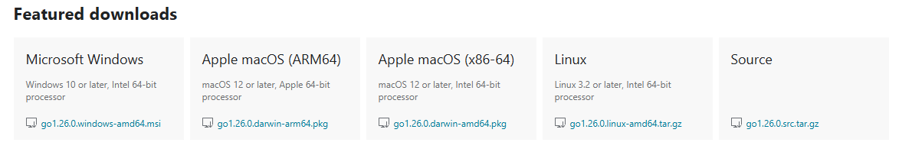

## Instalación y configuración

_Estas instrucciones son del [sitio oficial](https://go.dev/doc/install)._

### MacOS

1. Abre el archivo del paquete que descargaste y sigue las instrucciones para instalar Go.
   El paquete instala la distribución de Go en `/usr/local/go`. El paquete debería colocar el directorio `/usr/local/go/bin` en tu variable de entorno `PATH`.
   Es posible que tengas que reiniciar cualquier sesión de Terminal abierta para que el cambio surta efecto.
2. Comprueba que has instalado Go abriendo un símbolo del sistema y escribiendo el siguiente comando:

```
$ go version
```

3. Confirma que el comando muestra la versión instalada de Go.

### Linux

1. Elimina cualquier instalación anterior de Go borrando la carpeta `/usr/local/go` (si existe)
   y, a continuación, extrae el archivo que acabas de descargar en `/usr/local`, creando un nuevo árbol Go en `/usr/local/go`:

```
$sudo rm -rf /usr/local/go && tar -C /usr/local -xzf go1.18.1.linux-amd64.tar.gz
```

**No descomprimas** el archivo en un árbol `/usr/local/go` existente. Se sabe que esto provoca instalaciones defectuosas de Go.

2. Añade `/usr/local/go/bin` a la variable de entorno PATH.
   Puedes hacerlo añadiendo la siguiente línea a tu `$HOME/.profile` o `/etc/profile` (para una instalación en todo el sistema) o en tu `$HOME/.bashrc` (para una instalación únicamente en la cuenta del usuario), donde `$HOME` es la ruta por defecto del usuario:

```
export PATH=$PATH:/usr/local/go/bin
```

_Nota: Es posible que los cambios realizados en un archivo de perfil no se apliquen hasta la próxima vez que inicies sesión en tu ordenador. Para aplicar los cambios inmediatamente, simplemente ejecuta los comandos del terminal directamente o ejecútelos desde el perfil utilizando un comando como `source $HOME/.profile` (si es `.profile`) o `source $HOME/.bashrc` (si es `.bashrc`)._

3. Comprueba que has instalado Go abriendo un símbolo del sistema y escribiendo el siguiente comando:

```
$ go version
```

4. Confirma que el comando muestra la versión instalada de Go.

### Windows

1. Abre el archivo _MSI_ que has descargado y sigue las instrucciones para instalar Go.

De forma predeterminada, el instalador instalará Go en _Archivos de programa_ o _Archivos de programa (x86)_.
Puedes cambiar la ubicación según sea necesario. Después de la instalación, deberás cerrar y volver a abrir cualquier símbolo del sistema abierto para que los cambios en el entorno realizados por el instalador se reflejen en el símbolo del sistema.

2. Comprueba que has instalado Go.
   1. En Windows, haz clic en el menú Inicio.
   2. En el cuadro de búsqueda del menú, escribe cmd y pulse la tecla Intro.
   3. En la ventana del símbolo del sistema que aparece, escribe el siguiente comando:

```
$ go version
```

3. Confirma que el comando muestra la versión instalada de Go.

En cualquiera de los casos también se puede instalar Go mediante gestor de paquetes, en cuyo caso, se realizará de forma automática.

## VS Code

En este curso, utilizaré [VS Code](https://code.visualstudio.com), que puedes descargar desde [aquí](https://code.visualstudio.com/download).

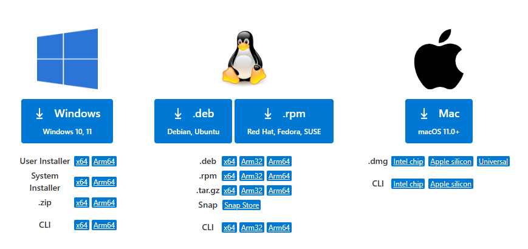

_Siéntete libre de utilizar cualquier otro editor de código que prefieras._

##  Extensión

Asegúrate de instalar también la [extensión Go](https://code.visualstudio.com/docs/languages/go), que facilita el trabajo con Go en VS Code.


Esto es todo en cuanto a la instalación y configuración de Go. ¡Empecemos el curso y escribamos nuestro primer «hola mundo»!


# Comandos básicos de Go

Los comandos más habituales de Go son:
- ```$ go build ```

Si se ejecuta desde el directorio raíz del proyecto, genera un archivo ejecutable del proyecto.
- ```$ go run <archivo>.go ```

Si queremos ejecutar el programa de Go directamente sin generar el ejecutable.

- ```$ go fmt ./... ```

Es un comando que formatea automáticamente todo el código fuente del proyecto (`./...`) y está impuesto por el lenguaje para que podamos centrarnos en cómo funciona nuestro código en lugar de cómo se ve.

Esto puede parecer un poco extraño al principio, pero francamente, es muy agradable no preocuparse por estas cuestiones.

- ```$ go vet ```

Es un comando que analiza el código e informa sobre posibles errores o cosas sospechosas que compilan pero probablemente están mal.

Si cometo un error de sintaxis y luego ejecuto `go vet`, debería notificármelo.


- ```$ go doc ```

Es la herramienta de Go para generar y ver documentación del código a partir de los comentarios que se escriben.

También permite mostrar la documentación de un paquete o símbolo; aquí tenéis un ejemplo con el paquete `fmt`.

```bash
$ go doc -src fmt Printf
```

- ```$ go get ```

Es un comando de Go que se usa para descargar dependencias (librerías) desde internet y se añaden al proyecto a través de `go.mod`.

- ```$ go install```

Es un comando de Go que compila e instala binarios/ejecutables desde internet. Ignora `go.mod` del directorio actual.

- ```$ go mod ```

Es un comando que se usa en Go para gestionar los módulos del proyecto: dependencias, versiones y configuración del proyecto.

-  ```$ golint ```

Es un comando que se usa en Go para analizar los comentarios del proyecto.

# Hola Mundo

Escribamos nuestro primer programa «hola mundo». Podemos empezar inicializando un módulo. Para ello, podemos utilizar el comando `go mod`.

```bash
$ go mod init ejemplo
```

Pero espera... ¿qué es un «módulo»? Por ahora, basta con que pienses que un módulo es básicamente una colección de paquetes Go.

Continuemos. Ahora vamos a crear un archivo `main.go` y a escribir un programa que simplemente imprima «hola mundo».

```go
package main

import "fmt"

func main() {
	fmt.Println("Hola Mundo!")
}
```

Si te lo estás preguntando, `fmt` forma parte de la biblioteca estándar de Go, que es un conjunto de paquetes básicos proporcionados por el lenguaje.

## Estructura de un programa Go

Ahora, analicemos rápidamente lo que hemos hecho aquí, o más bien la estructura de un programa Go.

En primer lugar, hemos definido un paquete como `main`.

```go
package main
```

A continuación, tenemos algunas importaciones.

```go
import "fmt"
```

Por último, pero no menos importante, está nuestra función `main`, que actúa como punto de entrada para nuestra aplicación, al igual que en otros lenguajes como C, Java o C#.

```go
func main() {
    ...
}
```

Recuerda que el objetivo aquí es tomar nota mentalmente y, más adelante, aprenderemos sobre «funciones», «importaciones» y otras cosas en detalle.

Por último, para ejecutar nuestro código, simplemente podemos usar el comando `go run`.

```bash
$ go run main.go
¡Hola, mundo!
```

¡Enhorabuena, acabas de escribir tu primer programa Go!

# Variables, constantes y tipos de datos


Antes de profundizar en detalle en cada uno de los tipos de datos, déjame explicarte primero como se define una variable y una constante.

## Variables

El patrón de los identificadores es el siguiente: `[_a-zA-Z][_a-zA-Z0-9_]*`. Esto es, empiezan por letra o `_`.
Aun así, las guías de estilo de Go recomiendan preferir usar el estilo `camelCase` y `PascalCase`, usando `_` solo en casos muy puntuales (por ejemplo, nombres generados, pruebas, etc.).

Para los despistados:
- `camelCase` es una convención de nomenclatura en programación que une palabras sin espacios, donde la primera letra de la primera palabra va en minúscula y las siguientes palabras comienzan con mayúscula.
- `PascalCase` es una convención de nomenclatura en programación donde TODAS las palabras comienzan con letra mayúscula, sin espacios ni separadores.

Ejemplo:

```go
miNombreCompleto     // camelCase
controladorPrincipal // camelCase 
numFilasTabla        // camelCase
MiNombreCompleto     // PascalCase
ControladorPrincipal // PascalCase 
```

Ya estamos en disposición de declarar una variable. Es lo que se conoce como declaración sin inicialización:

```go
var foo int
```

Declaración con inicialización:

```go
var foo int = 0
```

Declaraciones múltiples:

```go
var foo, bar int = 0, 1
// OR
var (
	foo int = 0
	bar int  = 1
)
```

El tipo se omite, pero se inferirá:

```go
var foo = 0
```

**Declaración abreviada**: aquí omitimos la palabra clave `var` y el tipo siempre es implícito. Así es como veremos declaradas las variables la mayoría de las veces. También usamos `:=` para la declaración más la asignación.

```go
foo := 2
```

_Nota: La abreviatura solo funciona dentro de los cuerpos de las `function`._

Hay que destacar que jamás una variable podrá tener el mismo nombre que una palabra reservada. A ese efecto, existen un total de 25 palabras reservadas.

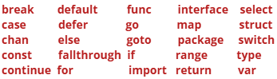

## Constantes

También podemos declarar constantes con la palabra clave `const`. Como su nombre indica, son valores fijos que no se pueden reasignar.

```go
const constante = "Es un ejemplo de constante"
```

Del mismo modo, cuando se definen múltiples constantes, se pueden agrupar semánticamente bajo la misma directiva `const`:

```go
const TipoFuente string = "Times New Roman"
const TamanoFuente int = 12
const Subrayado, Negrita boolean = false, true
// OR
const(
	TipoFuente string = "Times New Roman"
	TamanoFuente int = 12
	Subrayado boolean = false
	Negrita boolean = true
)
```

También es importante señalar que solo las constantes pueden asignarse a otras constantes.

```go
const num1 = 10
const num2 = num1 // ok
```


```go
var num1 = 10
const num2 = num1 // ko (variable de tipo int) no es constante (InvalidConstInit)
```

## Tipos de datos

¡Perfecto! Ya podemos seguir con los tipos de datos. Estos son los que proporciona Go:

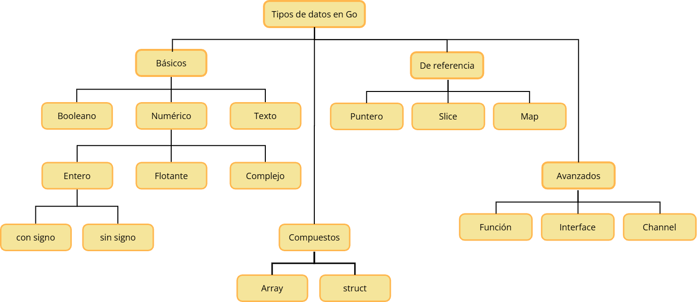

Comencemos por los **tipos básicos** y más concretamente por las cadenas (`strings`).


### Cadenas

En Go, una cadena es una secuencia de bytes. Se declaran utilizando comillas dobles o comillas invertidas, que pueden abarcar varias líneas.

```go
var cadena string = "Esto es un ejemplo de Go"

var biocad string = `Soy un lenguaje estáticamente tipado.
									Fui diseñado  en Google.`
```

**Operadores**

Podemos utilizar los siguientes operadores en tipos cadena.


| Tipo                      | Sintaxis          |
|---------------------------|-------------------|
| Comparación lexicográfica | `>` `>=` `<` `<=` |
| Igualdad                  | `==` `!=`         |
 | Concatenación             | `+` |

A modo de ejemplo tenemos:

```go
s1 := "manzana"
s2 := "platano"

fmt.Println(s1 < s2)       // true (a < b)
fmt.Println("abc" < "abd") // true (diferencia en último carácter)
fmt.Println("Z" < "a")     // true (Z=90 < a=97 en ASCII) 
```

### Booleano

A continuación está `bool`, que se utiliza para almacenar valores booleanos. Puede tener dos valores posibles: `true` o `false`.

```go
var value bool = false
var isItTrue bool = true
```

**Operadores**

Podemos utilizar los siguientes operadores en tipos booleanos.

| Tipo     | Sintaxis   |
|----------|-----------------|
| Lógicos  | `&&` `\|\|` `!` |
| Igualdad | `==` `!=`       |

En Go, los operadores `&&` y `||` poseen **evaluación perezosa** (short-circuit). Eso significa que:
- con `&&` solo evalúan la segunda parte si la primera es verdadera.
- Con `||` la segunda no se evalúa si la primera ya hace que el resultado sea verdadero.


### Tipos numéricos

Ahora, hablemos de los tipos numéricos.

**Enteros con y sin signo**

Go tiene varios tipos enteros integrados de diferentes tamaños para almacenar enteros con y sin signo.

El tamaño de los tipos genéricos `int` y `uint` depende de la plataforma. Esto significa que tiene 32 bits de ancho en un sistema de 32 bits y 64 bits de ancho en un sistema de 64 bits.

```go
var i int = 302                    // Depende de la plataforma
var i8 int8 = 114                  // -128 a 127
var i16 int16 = 32767              // -2^15 a 2^15 - 1
var i32 int32 = -1147485649        // -2^31 a 2^31 - 1
var i64 int64 = 78337203685478907  // -2^63 a 2^63 - 1
```

Al igual que los enteros con signo, también existen los enteros sin signo.

```go
var ui uint = 302                     // Depende de la plataforma
var ui8 uint8 = 255                   // 0 a 255
var ui16 uint16 = 65535               // 0 a 2^16
var ui32 uint32 = 1147485649          // 0 a 2^32
var ui64 uint64 = 78337203685478907   // 0 a 2^64
var uiptr uintptr                     // Representación entera de una dirección de memoria
```

Si te has fijado, también hay un tipo de puntero entero sin signo `uintptr`, que es una representación entera de una dirección de memoria. No se recomienda utilizarlo, por lo que no tenemos que preocuparnos por él.

**Entonces, ¿cuál debemos utilizar?**

Se recomienda que, siempre que necesitemos un valor entero, utilicemos simplemente `int`, a menos que tengamos una razón específica para utilizar un tipo entero con tamaño o sin signo.

**Byte y Rune**

Golang tiene dos tipos de enteros adicionales llamados `byte` y `rune`, que son alias de los tipos de datos `uint8` e `int32`, respectivamente.


```go
type byte = uint8
type rune = int32
```

_Un `rune` representa un punto de código Unicode._

```go
var b byte = 'a'
var r rune = '🍕'
```

**Punto flotante**

A continuación, tenemos los tipos de punto flotante, que se utilizan para almacenar números con un componente decimal.

Go tiene dos tipos de punto flotante: `float32` y `float64`. Ambos tipos siguen el estándar IEEE-754.

_El tipo predeterminado para los valores de punto flotante es float64._

```go
var f32 float32 = 1.7812 // IEEE-754 32-bit
var f64 float64 = 3.1415 // IEEE-754 64-bit
```

**Operadores**

Go proporciona varios operadores para realizar operaciones con tipos numéricos.

| Tipo                    | Sintaxis                                                 |
|-----------------------|----------------------------------------------------------|
| Aritmético            | `+` `-` `*` `/` `%`                                      |
| Comparación           | `==` `!=` `<` `>` `<=` `>=`                              |
| Bit a bit             | `&` `\|` `^` `<<` `>>`                                   |
| Incremento/decremento | `++` `--`                                                |
| Asignación            | `=` `+=` `-=` `*=` `/=` `%=` `<<=` `>>=` `&=` `\|=` `^=` |

**Complejos**

Hay dos tipos complejos en Go: `complex128`, donde tanto la parte real como la imaginaria son `float64`, y `complex64`, donde la parte real y la imaginaria son `float32`.

Podemos definir números complejos utilizando la función compleja integrada o como literales.

```go
var c1 complejo128 = complex(24, 53)
var c2 complejo64 = 18 + 24i
```

## Conversión de tipos

Ahora que ya hemos visto cómo funcionan los tipos básicos de datos, veamos cómo se realiza la conversión de tipos. En Go, a didiferencia de lo que ocurre en otros lenguajes de tipado estático, si se quiere asignar una variable numérica a otra variable de otro tipo numérico, se deberá de explicitar el tipo de destino.

```go
var segundos int8 = 30
var horas int
horas = int(segundos)
```

Otro ejemplo podría ser:

```go
distancia := 15.78
kms := int(distancia) //se trunca la parte con decimales
fmt.Printf(kms)
```
```bash
$ go run main.go
15
```

Finalmente, otro ejemplo sería:
```go
i:= 15
f := float64(i)
u := uint(f)

fmt.Printf("%T %T", f, u)
```

```bash
$ go run main.go
float64 uint
```
Y, como podemos ver, imprime el tipo como `float64` y `uint`.

_Ten en cuenta que esto es diferente del análisis sintáctico._


## Valores por defecto o valores cero

Ahora hablemos de los valores por defecto o valores cero. En Go, cualquier variable declarada sin un valor inicial explícito recibe un valor por defecto o también denominado valor cero. Por ejemplo, declaremos algunas variables y veamos:

```go
var i int
var f float64
var b bool
var s string

fmt.Printf("%v %v %v %q\n", i, f, b, s)
```

```bash
$ go run main.go
0 0 false ""
```

Como podemos ver, a `int` y `float` se les asigna el valor 0, a `bool` se le asigna el valor false y a `string` se le asigna una cadena vacía. Esto es muy diferente a cómo lo hacen otros lenguajes. Por ejemplo, la mayoría de los lenguajes inicializan las variables no asignadas como nulas o indefinidas.

Esto está muy bien, pero ¿qué son esos símbolos de porcentaje en nuestra función `Printf`? Como ya habrás adivinado, se utilizan para dar formato y los veremos más adelante.

## Tipos alias, definidos y enumeraciones

Los **tipos alias** se introdujeron en Go 1.9. Permiten a los desarrolladores proporcionar un nombre alternativo para un tipo existente y utilizarlo indistintamente con el tipo subyacente. Esta modalidad no crea un tipo nuevo.

```go
package main

import "fmt"

type Estado = string

const (
	activo Estado = "activo"
	inactivo Estado = "inactivo"
)
func main() {
	var str Estado = activo

	fmt.Printf("%T - %s", str, str) // Salida: string - activo
}
```

Por último, podemos definir tipos, a diferencia de los tipos alias, no utilizan el signo `=` para su declaración. Esta modalidad de tipos permite crear un tipo nuevo y se denominan **tipos definidos**.

```go
package main

import "fmt"

type Estado string

const (
  activo Estado = "activo"
  inactivo Estado = "inactivo"
)
func main() {
  var str Estado = activo

  fmt.Printf("%T - %s", str, str) // Salida: main.Estado - activo
}
```

**Pero espera... ¿cuál es la diferencia?**

Los tipos definidos hacen más que simplemente dar un nombre a un tipo.

En primer lugar, definen un nuevo tipo con nombre con un tipo subyacente. Sin embargo, este tipo definido es diferente de cualquier otro tipo, incluido su tipo subyacente.

Por lo tanto, no se puede utilizar indistintamente con el tipo subyacente como los tipos alias.

Al principio resulta un poco confuso, pero esperamos que este ejemplo lo aclare.

```go
package main

import "fmt"

type EstadoAlias = string
type EstadoDefinido string

func main() {
	var alias EstadoAlias
	var def EstadoDefinido

	// ok
	var copy1 string = alias

	// ko No se puede utilizar def (variable de tipo EstadoDefinido) como valor de cadena en la variable
	var copy2 string = def

	fmt.Println(copy1, copy2)
}
```

Como podemos ver, no podemos utilizar el tipo definido de forma intercambiable con el tipo subyacente, a diferencia de los tipos _alias_.

Hasta ahora hemos visto como podemos usar tipos alias o tipos definidos, en ambos casos utilizado `string`. Estos tipos también se pueden usar con `int`. Cuando eso ocurre podemos crear enumeraciones.

Go no tiene un tipo enumeración nativo como puede occurrir en otros lenguajes de programación como C o Java. Sin embargo, se pueden implementar mediante tipos y constantes.

```go
package main

import "fmt"
type Color int // también podría ser un tipo predefinido

const (
  Verde Color = iota
  Rojo
  Azul
) 

func main() {
	var c Color = Verde
	if c == Verde {
		fmt.Println("Verde")
    }
}
```

¿Qué hace `iota`? Genera valores enteros automáticos.
```go
Verde  = 0
Rojo = 1
Azul  = 2
```
Esto funciona porque `iota` es un contador entero y sirve para serializar números y permite comparar rápidamente.

# Formato de cadenas

En este tutorial, aprenderemos sobre el formato de cadenas.

El paquete `fmt` contiene muchas funciones. Para ahorrar tiempo, analizaremos las funciones más utilizadas. Comencemos con la salida estándar de datos. Existen las siguientes funciones:
```go
fmt.Print
fmt.Println
fmt.Printf
```
Tanto `fmt.Print` como `fmt.Println` enviarán a la salida estándar  los datos que figuren entre paréntesis y separados por comas. En caso de datos que no sean cadenas de texto, Go realizará una conversión a texto antes de enviarlo a la salida estándar.

```go
...

fmt.Print("Dime", "tu", "nombre",".")
fmt.Print("Mi", "nombre", "es", "Go")
...
```

```bash
$ go run main.go
Dimetunombre.MinombreesGo
```

Como podemos ver, `Print` no formatea nada, simplemente toma una cadena y la imprime.

Sin embargo, cuando se usa `Println`, este añade un espacio entre los datos e introduce un retorno de carro al final.

```go
...

fmt.Println("Dime", "tu", "nombre",".")
fmt.Println("Mi", "nombre", "es", "Go")
...
```

```bash
$ go run main.go
Dime tu nombre.
Mi nombre es Go
```

A continuación, tenemos `Printf`, también conocido como **formateador de impresión**, que nos permite formatear números, cadenas, booleanos y mucho más.

Veamos un ejemplo.

```go
...
nombre := "Go"

fmt.Println("Dime tu nombre.")
fmt.Printf("Mi nombre es %s", nombre)
...
```

```bash
$ go run main.go
Dime tu nombre.
Mi nombre es Go
```

Como podemos ver, `%s` se sustituyó por nuestra variable `nombre`.

Pero la pregunta es: ¿qué es `%s` y qué significa?

Se denominan **verbos de anotación** y le indican a la función cómo formatear los argumentos. Con ellos podemos controlar aspectos como el ancho, los tipos y la precisión, y hay muchos. Aquí hay una [hoja de referencia](https://pkg.go.dev/fmt).

A modo de resumen tenemos:

| Verbo | Descripción                                                          |
|-------|----------------------------------------------------------------------|
| %v    | Valor en el formato por defecto o valor cero                         |
| %T    | Tipos de datos                                                       |
| %d    | Valor numérico en base decimal                                       |
| %b   | Valor numérico en base binario                                       |
| %o    | Valor numérico en base octal                                         |
| %x    | Valor numérico en base hexadecimal (con letras de a-f en minúsculas) |
| %X    | Valor numérico en base hexadecimal (con letras de A-F en mayúsculas) |
| %e    | Notación científica                                                  |
| %f    | Número en coma flotante                                              |
| %c    | Carácter individual                                                  |
| %s    | Cadena de texto                                                      |
| %q    | Cadena de texto delimitado por comillas dobles                       |

Ahora, veamos rápidamente algunos ejemplos más. Aquí intentaremos calcular un porcentaje y mostrarlo en la consola.
```go
...
porcentaje := (81.5 / 9) * 100
fmt.Printf("%f", porcentaje)
...
```

```bash
$ go run main.go
905.555556
```

Supongamos que solo queremos `905.55`, que tiene una precisión de 2 puntos. También podemos hacerlo utilizando `.2f`.

Además, para añadir un signo de porcentaje real, tendremos que _escaparlo_.

```go
...
porcentaje := (81.5 / 9) * 100
fmt.Printf("%.2f %%", porcentaje)
...
```

```bash
$ go run main.go
905.55 %
```

Esto nos lleva a `Sprint`, `Sprintln` y `Sprintf`. Básicamente son iguales que las funciones de impresión, con la única diferencia de que devuelven la cadena en lugar de imprimirla.

Veamos un ejemplo.

```go
...
s := fmt.Sprintf("hex:%x bin:%b", 15 ,15)
fmt.Println(s)
...
```

```bash
$ go run main.go
hex:f bin:1111
```

Por lo tanto, como podemos ver, `Sprintf` formatea nuestro entero como hexadecimal o binario y lo devuelve como una cadena.

¡Genial! Pero esto es solouna pequeña parte... así que si quieres saber más asegúrate de consultar la documentación del paquete `fmt`.

Para aquellos que provienen del mundo de C/C++, esto debería resultaros natural, pero si provienes, por ejemplo, de Python o JavaScript, puede que al principio te resulte un poco extraño. Sin embargo, es muy potente y verás que esta funcionalidad se utiliza bastante.

# Control de flujo

Hablemos del control de flujo. En Go se permite alterar el flujo secuencial mediante los bloques de control de flujo, que se agrupan en dos tipos:
* **Condicionales**: Permiten que un bloque de instrucciones se ejecute o no, dependiendo de si se cumple una condición en el programa.
* **Iterativos**: Permiten que un bloque de instrucciones se ejecute repetidamente mientas se dé una condición.

Por condición entendemos cualquier expresión booleana que retorne `true` o `false`.

Empecemos por los bloques condicionales, y más concretamente por las sentencias `if/else`.

## Bloques condicionales

### Sentencias If/else

Funciona prácticamente igual de lo que cabría esperar, pero la expresión no necesita ir entre paréntesis `()`.

```go
func main() {
	a := 5
	if a == 0 {
		fmt.Println("a vale 0")
	} else if a > 0 {
		fmt.Println("a es positivo")
	} else {
		fmt.Println("a es negativo")
	}
}
```

```bash
$ go run main.go
a es positivo
```

#### Sentencia if compacto

Go permite declarar variables dentro del if de forma compacta siguiendo la siguiente estructura:

```go
if variable := expresión; condición {
    // código
}
```

Para ilustrarlo, pongamos por caso el siguiente ejemplo:
```go
func main() {
	if a := 10; a > 0 {
		fmt.Println("a es mayor que 0")
	}
}
```
Como se puede observar, `a` se declara en la cabecera del `if` y solo existe dentro de él. No es visible fuera

_Nota: Este forma de expresar las sentencias `if` es muy común mostrar resultados temporales, errores o cálculos cortos._

### Switch
A continuación tenemos la sentencia `switch`, que suele ser una forma más clara y compacta de escribir lógica condicional.

En Go, el `switch` ejecuta solo el primer case que coincide con la expresión evaluada.

A diferencia de otros lenguajes (como C o Java), no es necesario escribir `break`, ya que Go lo añade implícitamente al final de cada `case`.

Esto significa que los casos se evalúan de arriba hacia abajo y el `switch` se detiene cuando uno coincide.

Veamos un ejemplo:

```go
func main() {
  x := 'a'
  
  switch x {
    case 'a':
        fmt.Println("letra a")
    case 'b':
        fmt.Println("letra b")
    case 'c':
        fmt.Println("letra c")
    default:
        fmt.Println("otra letra")
  }
}
```

```bash
$ go run main.go
letra a
```

Del mismo modo podemos tener varios valores dentro de un mismo `case`:

```go
func main() {
  x := 'a'
  
  switch x {
    case 'a', 'b', 'c':
        fmt.Println("letra entre la a y la c")
    case 'd', 'e', 'f':
        fmt.Println("letra entre la d y la e")
    default:
        fmt.Println("otra letra")
  }
}
```

```bash
$ go run main.go
letra entre la a y la c
```
También podemos utilizarlo sin ninguna condición, lo que equivale a `switch true`. Básicamente permite simular el comportamiento de `ìf-else` usando un `switch` sin expresión. Es la forma habitualmente empleada para incluir rangos en las condiciones.
```go
func main() {
	nota := 8
	switch {
	    case nota >= 9:
            fmt.Println("sobresaliente")
        case nota >= 5:
			fmt.Println("aprobado")
        default:
			fmt.Println("suspenso")
    }
}
```

```bash
$ go run main.go
aprobado
```

Al igual que vimos en la sentencia compacta de `if`, `switch` también permite una declaración corta en su cabecera:

```go
	switch x:='a'; x {
        case 'a':
            fmt.Println("letra a")
        case 'b':
            fmt.Println("letra b")
        case 'c':
            fmt.Println("letra c")
        default:
            fmt.Println("otra letra")
}
```

En este caso, `x` solo es visible dentro del `switch`.

Finalmente, por defecto, Go no continúa al siguiente caso. Se para en la primera coincidencia. Sin embargo, podemos forzar que lo haga usando la palabra clave `fallthrough` para transferir el control al siguiente caso. 

Esto significa que `fallthrough` no vuelve a evaluar la condición del siguiente case. Simplemente ejecuta el siguiente bloque.

```go
	switch x:='a'; x {
        case 'a':
            fmt.Println("letra a")
            fallthrough
        case 'b':
            fmt.Println("letra b")
        case 'c':
            fmt.Println("letra c")
        default:
            fmt.Println("otra letra")
    }
```

Y si ejecutamos esto, veremos que después de que el primer caso coincida, la instrucción switch continúa con el siguiente caso debido a la palabra clave `fallthrough`.

```bash
$ go run main.go
letra a
letra b
```

## Bloques iterativos

Ahora, vamos a ver los bucles. Se trata de un conjunto de órdenes que se repite.

En Go solo tenemos un tipo de bucle, que es el bucle `for`.

Es increíblemente versátil. Al igual que la instrucción `if`, el bucle `for` no necesita paréntesis `()`, a diferencia de otros lenguajes.

### Bucle for clásico

Comencemos con el bucle clásico `for`.

```go
func main() {
	for i := 1; i <=5; i++ {
		fmt.Println("Valor",i)
	}
}
```

El bucle clásico `for` tiene tres componentes separados por punto y coma:

- **Sentencia de inicio**: se ejecuta antes de la primera iteración.
- **Expresión condicional**: se evalúa antes de cada iteración.
- **Sentencia post**: que se ejecuta al final de cada iteración.

**Break y continue**

Como era de esperar, Go también admite las instrucciones `break` y `continue` para el control de bucles. Veamos un ejemplo rápido:

```go
func main() {
	for i := 1; i <=5; i++ {
		if i < 2 {
			continue
		}

		fmt.Println(i)

		if i > 3 {
			break
		}
	}

	fmt.Println("Salimos del bucle")
}
```

Por lo tanto, la instrucción `continue` se utiliza cuando queremos omitir la parte restante del bucle, y la instrucción `break` se utiliza cuando queremos salir del bucle.

Además, las instrucciones `init` y `post` son opcionales, por lo que también podemos hacer que nuestro bucle `for` se comporte como un bucle `while`.

```go
func main() {
	i := 0

	for ;i < 10; {
		i += 1
	}
}
```

_Nota: también podemos eliminar los puntos y comas adicionales para que quede un poco más limpio._

### Bucle infinito

Por último, si omitimos la condición del bucle, este se repetirá indefinidamente, por lo que se puede expresar de forma compacta un bucle infinito.

```go
func main() {
	for {
		// instrucciones
	}
}
```

Si además dentro de un bucle infinito introduzco la instrucción `break`, se consigue que nuestro bucle `for` se comporte como un bucle `do while`. A modo de ejemplo tenemos lo siguiente:
```go
func main() {
	i:=1
	for {
		fmt.Println("Valor", i)
		if i==5 {
		    break	
        }
		i=i+1
	}
}
```


# Funciones

En este tutorial, vamos a ver cómo trabajar con funciones en Go. Empecemos con una declaración de función sencilla.

## Declaración sencilla

Se trata de un código que define una función que al invocarse, muestra por pantalla un sencillo texto `Hola`.

```go
func miFuncion() {
	fmt.Println("Hola")
}
```

Y podemos _llamarla o ejecutarla_ de la siguiente manera.

```go
...
miFuncion()
...
```
Las funciones se definen fuera del cuerpo de la función `main`, y suelen invocarse desde el código de las propias funciones, mediante el nombre de la función seguido de dos paréntesis.

Aunque un función ejecuta siempre el mismo código, se puede modificar ligeramente su comportamiento si se definen **argumentos** (o **parámetros**) entre los paréntesis de la cabecera de la función.
Estos argumentos consisten en un nombre seguido de un tipo (como de una variable se tratara). Los diferentes argumentos se separan por comas. 

Por ejemplo, en la anterior función podríamos pasar el siguientes parámetro.

```go
func miFuncion(p1 string) {
	fmt.Println(p1)
}

func main() {
    miFuncion("Hola")
}
```

```bash
$ go run main.go
```

Como podemos ver, imprime nuestro mensaje. También podemos hacer una declaración abreviada si los parámetros consecutivos son del mismo tipo. Por ejemplo:

```go
func miSiguienteFuncion(p1, p2 string) {}
```

## Retorno de valor

Ahora devolvamos también un valor. El tipo de retorno se declara al final de la cabecera de la función, cuando se cierran los paréntesis de los argumentos, y el retorno de la palabra resultante se especifica con la palabra `return` en el cuerpo de la función.

```go
func main() {
	s := miFuncion("Hola")
	fmt.Println(s)
}

func miFuncion(p1 string) string {
	msg := fmt.Sprintf("Funcion %s ", p1)
	return msg
}
```

### Devoluciones múltiples

¿Por qué devolver un valor cada vez, cuando podemos hacer más? ¡Go también admite devoluciones múltiples! En vez de especificar un solo tipo de retorno, se especificarán varios tipos de retorno separados por comas.

```go
func miFuncion(p1 string) (string, int) {
	msg := fmt.Sprintf("Funcion %s ", p1)
	return msg, 10
}

func main() {
    s, i := miFuncion("Hola")
    fmt.Println(s, i)
}
```

Una función que retorno múltiples valores no se puede invocar en medio de una expresión matemática. Se debe previamente recoger los valores especificando múltiples variables, separadas por comas.

En el anterior ejemplo, el primer valor devuelto se guardará en la variable `s` y el segundo valor en `i`.

### Retornos con nombre

Otra característica interesante son los [retornos con nombre](https://go.dev/tour/basics/7), en los que los valores devueltos pueden nombrarse y tratarse como variables propias.

```go
func miFuncion(p1 string) (s string, i int) {
	s = fmt.Sprintf("Funcion %s ", p1)
	i = 10

	return
}
```

Observe cómo hemos añadido una instrucción `return` sin ningún argumento, lo que también se conoce como _naked return_.

Aunque esta característica es interesante, le recomiendo que la utilice con precaución, ya que puede reducir la legibilidad de las funciones más grandes.

## Funciones como valores

A continuación, hablemos de las funciones como valores. En Go, las funciones son valores como cualquier otro (int, string, etc.). Esto significa que puedes:

- Asignarlas a variables
```go
// 1. Asignar función a variable
saludar := func(nombre string) {
    fmt.Println("Hola", nombre)
}
saludar("Ana")  // Hola Ana
```
- Pasarlas como argumentos
```go
// 2. Pasar función como argumento
func ejecutar(fn func(string), texto string) {
    fn(texto)
}
ejecutar(saludar, "Juan")  // Hola Juan
```
- Devolverlas desde otras funciones
```go
// 3. Devolver la función
func crearSaludo() func(string) {
    return func(nombre string) {
        fmt.Println("Hola", nombre)
    }
}
miSaludo := crearSaludo()
miSaludo("Pedro")  // Hola Pedro
```

Otro ejemplo podría ser el siguiente:
```go
func miFuncion() {
    fn := func() {
        fmt.Println("dentro de la funcion")
    }
    fn()
}
```
También podemos simplificarlo haciendo que `fn` sea una _función anónima_.

```go
func miFuncion() {
	func() {
		fmt.Println("dentro de la funcion")
	}()
}
```

_Fíjate en cómo lo ejecutamos utilizando los paréntesis al final._


## Clausuras

¿Por qué detenernos aquí? Vamos ahora con las clausuras (en inglés _closure_). En Go, una clausura es una función anónima que captura y mantiene acceso a las variables de su ámbito exterior, incluso después de que ese ámbito haya terminado. Dicho de forma más sencillo,  es una función que recuerda las variables que existían cuando fue creada.

En Go, la signatura de una función (la definición de sus argumentos y tipos de retorno) es un tipo de dato por sí mismo. Esto significa que se puede declarar una variable o un argumento de tipo función. Es lo que da lugar a las clausuras. 

Las características clave en Go:
- Funciones anónimas: Go permite definir funciones sin nombre,
- Captura de variables: La función "recuerda" las variables del ámbito donde se creó,
- Estado privado: Esas variables persisten entre llamadas y son inaccesibles desde fuera.

```go
func contador() func() int {
    x := 0  // Variable "capturada"
    return func() int {
        x++     // Accede y modifica la variable externa
        return x
    }
}

func main() {
    c1 := contador()  // Crea clausura 1 con su propio x=0
    c2 := contador()  // Crea clausura 2 con su propio x=0

    fmt.Println("contador: ", c1(), c1(), c2()) // 1 (x de c1 ahora vale 1), 2 (x de c1 ahora vale 2), 1 (x de c2 vale 1, independiente)
}
```
El resultado sería el siguiente:
```bash
contador: 1 2 1
```

Una potente característica de las clausuras es que una variable del tipo "signatura de función" acepta una referencia a cualquier función existente, siempre que esta comparta la misma signatura. A modo de ejemplo:

```go
func suma(a,b int) int {
	return a+b
}
func multiplica(a,b int) int{
	return a*b
}
func main(){
	var operador func(int,int) int
	operador=suma
	fmt.Println("suma =", operador(3,4))
	operador=multiplica
	fmt.Println("multiplica =", operador(3,4))
}
```
Mostraría en pantalla:
```bash
suma =7
multiplica = 12
```

Otro posible ejemplo de clausura sería el siguiente:
```go
func miFuncion() func(int) int {
	sum := 0

	return func(v int) int {
		sum += v

		return sum
	}
}
```

```go
...
add := miFuncion()

add(5)
fmt.Println(add(10))
...
```
Analicemos el ejemplo:
- `miFuncion` devuelve una función `func(int) int`
Eso significa que recibe un `int` y devuelve un `int`.
- Dentro de `miFuncion` se crea una variable: `sum := 0`.
- Se devuelve una función anónima:
```go
return func(v int) int {
    sum += v
    return sum
}
```
Esa función usa la variable `sum`. Pero... `sum` no está dentro de la función anónima. Está fuera.

Ahí está la clausura. Como podemos ver, obtenemos un resultado de 15. Se trata de un concepto muy potente y, sin duda, imprescindible.

## Funciones variádicas

Ahora veamos las funciones variádicas, que son funciones que pueden tomar cero o múltiples argumentos utilizando el operador de elipsis `...`.

Un ejemplo aquí sería una función que puede sumar un conjunto de valores.

```go
func main() {
	sum := suma(1, 2, 3, 5)
	fmt.Println(sum)
}

func suma(values ...int) int {
	sum := 0

	for _, v := range values {
		sum += v
	}

	return sum
}
```

¿A que mola? Además, no te preocupes por la palabra clave `range`, la veremos más adelante en el curso.

_**Dato curioso**: `fmt.Println` es una función variádica, por eso hemos podido pasarle varios valores._

## El identificador vacío

El identificador vacío (representado por el guión bajo, `_`) premite descartar los valores devueltos por una función que se van a necesitar. Aquellos valores que no se van a usar se deben asignar a este identificador vacío, ya que Go no permite declarar variables que no se van a usar (el compilador devolvería un error).

```go
m, _ := MaxMin(3,6)

func MaxMin(a,b:int) (int,int) {
	if a>b {
		return a,b
    }   
	return b,a
}

```

En el ejemplo anterior, guardará en la variable `m` el primer valor retornado por la función, y descartaría el segundo valor.

Otra cuestión importante es que en Go, todas las variables declaradas deben utilizarse, de lo contrario el compilador genera un error. Una forma de evitar que de un error es que, aunque se definen variables de distintos tipos (`int, float64, bool y string`), si no se usan posteriormente en ninguna operación o salida, se puede emplear el identificador vacío, que permite realizar una asignación sin necesidad de almacenarlos ni procesarlos. De este modo, se le indica al compilador que las variables han sido utilizadas, aunque realmente se estén descartando.

```go
func main() {
    var a int = 10
    var b float64 = 3.14
    var c bool = true
    var d string = "Go"
    _, _, _, _ = a, b, c, d
}
```

## Inicialización

En Go, `init` es una función especial del ciclo de vida que se ejecuta antes de la función `main`.

Al igual que `main`, la función `init` no toma ningún argumento ni devuelve ningún valor. Veamos cómo funciona con un ejemplo.

```go
package main

import "fmt"

func init() {
	fmt.Println("Antes del main!")
}

func main() {
	fmt.Println("Ejecutando el main")
}
```

Como era de esperar, la función `init` se ejecutó antes que la función `main`.

```bash
$ go run main.go
Antes del main!
Ejecutando main
```

A diferencia de `main`, puede haber más de una función `init` en uno o varios archivos.

En el caso de varias funciones `init` en un solo archivo, su procesamiento se realiza en el orden en que se declaran, mientras que las funciones `init` declaradas en varios archivos se procesan según el orden lexicográfico de los nombres de archivo.
```go
package main

import "fmt"

func init() {
	fmt.Println("Antes del main!")
}

func init() {
	fmt.Println("Hola de nuevo")
}

func main() {
	fmt.Println("Ejecutando el main")
}
```

Y si ejecutamos esto, veremos que las funciones `init` se ejecutaron en el orden en que fueron declaradas.

```bash
$ go run main.go
Antes del main!
Hola de nuevo
Ejecutando el main
```

La función `init` es opcional y se utiliza especialmente para cualquier configuración global que pueda ser esencial para nuestro programa, como establecer una conexión con la base de datos, recuperar archivos de configuración, configurar variables de entorno, etc.

## Defer

Por último, veamos la palabra clave `defer`, que nos permite posponer la ejecución de una función hasta que la función circundante devuelva un resultado.

```go
func main() {
    defer fmt.Println("He terminado")
    fmt.Println("Haciendo algo de trabajo...")
}
```

¿Podemos usar varias funciones `defer`? Por supuesto, esto nos lleva a lo que se conoce como _pila defer_. Veamos un ejemplo:

```go
func main() {
    defer fmt.Println("He terminado")
    defer fmt.Println("¿Y tú?")

    fmt.Println("Trabajando...")
}
```

```bash
$ go run main.go
Haciendo algo de trabajo...
¿Y tú?
He terminado.
```

Como podemos ver, las sentencias `defer` se apilan y se ejecutan siguiendo el principio "_último en entrar, primero en salir_".

Por lo tanto, `defer` es increíblemente útil y se utiliza habitualmente para realizar tareas de limpieza o gestionar errores.

# Métodos

Hablemos de métodos, también conocidos como **receptores de funciones**.

Técnicamente, Go **NO es un lenguaje de programación orientado a objetos**. No tiene clases, objetos ni herencia tradicional. Sin embargo, Go **tiene tipos**. Y puedes definir métodos sobre tipos.

Un método es simplemente una **función con un receptor especial**. Veamos cómo declararlos:


```go
func (variable T) Nombre(params) (tiposRetorno) {}
```

El _receptor_ tiene un nombre y un tipo. Aparece entre la palabra clave `func` y el nombre del método.

Por ejemplo, definamos una struct `Libro`:

```go
type Libro struct {
    Titulo   string
    Paginas  int
}
```

Ahora definamos un método `EsLargo` que nos diga si un libro tiene más de 300 páginas:

```go
func (l Libro) EsLargo() bool {
    return l.Paginas > 300
}
```

Como ves, accedemos a la instancia de `Libro` usando la variable receptora `l`. Piensa en ella como el `this` de los lenguajes orientados a objetos.

Ahora podemos llamar al método tras inicializar nuestra struct, igual que con clases en otros lenguajes:

```go
func main() {
    libro := Libro{"El Quijote", 950}

    fmt.Println("¿Es largo?", libro.EsLargo())  // true
}
```

## Métodos con receptores por puntero

Todos los ejemplos anteriores usaban receptores por valor.

Con un **receptor por valor**, el método trabaja sobre una **copia** del valor. Las modificaciones al receptor NO se ven reflejadas en el original.

Por ejemplo, creemos un método `ActualizarNombre` que cambie el nombre del `Libro`:

```go
func (l Libro) ActualizarNombre(nuevoTitulo string) {
    l.Titulo = nuevoTitulo  // Cambia la COPIA
}
```

Probémoslo:

```go
func main() {
    libro := Libro{"El Quijote", 950}

    libro.ActualizarNombre("1984")
    fmt.Println("Libro:", libro)  // ¡Sigue siendo "El Quijote"!
}
```

```bash
$ go run main.go
Libro: {El Quijote 950}
```

El nombre no cambió. Cambiemos el receptor a puntero:

```go
func (l *Libro) ActualizarNombre(nuevoTitulo string) {
    l.Titulo = nuevoTitulo  // Cambia el ORIGINAL
}
```

```bash
$ go run main.go
Libro: {La Regenta 950}
```

¡Perfecto! Los métodos con **receptores por puntero modifican el valor original**, y esos cambios son visibles para quien llama al método.

## Propiedades de los métodos

Go tiene algunas características inteligentes:

- **Go interpreta automáticamente**: puedes llamar métodos de puntero tanto en valores como punteros

```go
libro.ActualizarNombre("Nuevo")  // Go hace &libro por ti
(&libro).ActualizarNombre("Nuevo")
```

- **Receptor sin nombre**: si no usas la variable del receptor

```go
func (_ *Libro) ActualizarNombre(nombre string) { ... }
```

- **Métodos NO solo para structs**: funcionan con cualquier tipo

```go
package main

import "fmt"

type MiEntero int

func (i MiEntero) EsMayor(valor int) bool {
	return i > MiEntero(valor)
}

func main() {
	n := MiEntero(10)
	fmt.Println(n.EsMayor(5))  // true
}
```

## ¿Por qué métodos en lugar de funciones?

Entonces, la pregunta es: ¿por qué usar métodos en lugar de funciones?

Como siempre, no hay una respuesta concreta para esto, y de ninguna manera uno es mejor que el otro. Más bien, deben usarse de forma adecuada según la situación.

Una cosa que se me ocurre ahora mismo es que los métodos pueden ayudarnos a evitar conflictos de nombres.

Dado que un método está asociado a un tipo en particular, podemos tener el mismo nombre de método para múltiples receptores.

Pero al final, puede reducirse simplemente a una cuestión de preferencia, como por ejemplo: _“las llamadas a métodos son mucho más fáciles de leer y entender que las llamadas a funciones”_, o al contrario.

# Paquetes

Ahora, hablaremos sobre **paquetes**.

## ¿Qué son los paquetes?

Un **paquete** no es más que un directorio que contiene uno o más archivos fuente de Go, u otros paquetes de Go.

Esto significa que todos los archivos fuente de Go deben pertenecer a un paquete, y la declaración del paquete se hace al inicio de cada archivo fuente así:


```go
package <nombre_paquete>
```

Hasta ahora, hemos hecho todo dentro de `package main`. Por convención, los programas ejecutables (es decir, los que tienen el paquete `main` package) se llaman _Commands_, los demás simplemente se llaman _Packages_.

El paquete `main` también debe contener una función `main()` que es una función especial que actúa como el punto de entrada de un **programa ejecutable**.

Veamos un ejemplo creando nuestro propio paquete `custom`  y añadiendo algunos archivos fuente como `code.go`.

```go
package custom
```

Antes de continuar, debemos hablar de **importaciones y exportaciones**. Al igual que otros lenguajes, Go también tiene un concepto de importaciones y exportaciones, pero es muy elegante.

Básicamente, cualquier valor (como una variable o función) puede ser **exportado** y visible desde otros paquetes si se define con un **identificador en mayúscula**.

Probemos un ejemplo en nuestro paquete `custom`.

```go
package custom

var value int = 10 // NO será exportado
var Value int = 20 // SÍ será exportado
```

Como vemos, los identificadores en **minúscula** NO se exportan y serán privados para el paquete en el que se definen. En nuestro caso, el paquete `custom`.

Está muy bien, pero ¿cómo lo importamos o accedemos a él? Bueno, igual que hemos estado haciendo hasta ahora sin saberlo. Vamos a nuestro archivo `main.go` e importamos nuestro paquete `custom`.

Aquí podemos referirnos a él usando el módulo que inicializamos en nuestro archivo `go.mod` anteriormente.

```go
---go.mod---
module example

go 1.18

---main.go--
package main

import "example/custom"

func main() {
	custom.Value
}
```

_Nota cómo el nombre del paquete es el último nombre de la ruta de importación._

También podemos importar múltiples paquetes así:

```go
package main

import (
	"fmt"
	"example/custom"
)

func main() {
	fmt.Println(custom.Value)
}
```

También podemos **poner alias** a nuestras importaciones para evitar colisiones así:

```go
package main

import (
	"fmt"
	abcd "example/custom"
)

func main() {
	fmt.Println(abcd.Value)
}
```

## Dependencias externas

En Go, no estamos limitados solo a trabajar con paquetes locales, también podemos instalar paquetes externos usando el comando `go get` como vimos al comienzo del tutorial.

Así que vamos a descargar un paquete de logging simple: `github.com/rs/zerolog/log`.

```bash
$ go get github.com/rs/zerolog
```

```go
package main

import (
	"github.com/rs/zerolog/log"

	abcd "example/custom"
)

func main() {
	log.Print(abcd.Value)
}
```

También asegúrate de revisar la **documentación Go** (`go doc`) de los paquetes que instales, que normalmente está ubicada en el archivo `README` del proyecto. go doc analiza el código fuente y genera documentación en formato HTML. La referencia a ella suele estar en los archivos `README`.

# Módulos

Ahora, lo siguiente que aprenderemos en este tutorial será lo relacionado con los módulos.

## ¿Qué son los módulos?

En términos simples, un módulo es una colección de [paquetes de Go](https://go.dev/ref/spec#Packages) agrupados en un mismo árbol de directorio con un fichero `go.mod` en su raíz, siempre que el directorio esté _fuera_ de `$GOPATH/src`. Un módulo puede contener tanto una biblioteca de funciones como un programa completo con su función `main`.  

Los módulos de Go se introdujeron en Go 1.11, que da soporte nativo para versiones y módulos. Antes necesitábamos la bandera `GO111MODULE=on` para activar los módulos cuando eran experimentales. Pero ahora, desde Go 1.13, el modo módulos es el predeterminado para todo desarrollo.

Pero espera, **¿qué es GOPATH?**

`GOPATH` es una variable que define la raíz del espacio de trabajo y contiene estas carpetas:
- **src**: contiene código fuente de Go organizado jerárquicamente
- **pkg**: contiene código de paquetes compilados
- **bin**: contiene binarios y ejecutables compilados

Como antes, creamos un nuevo módulo usando el comando `go mod init`, que crea un nuevo módulo e inicializa el archivo `go.mod` que lo describe:

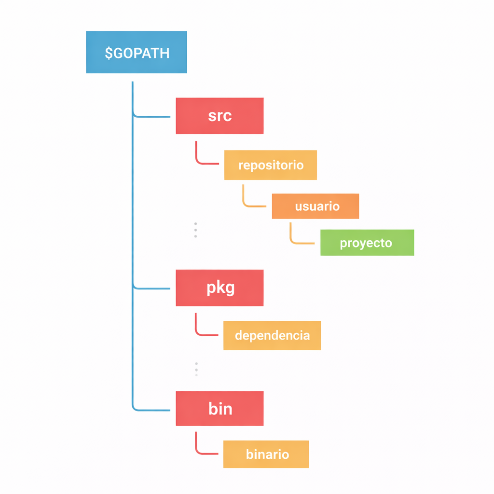

```bash
$ go mod init ejemplo
```

Lo importante aquí es que un módulo de Go puede corresponder a un repositorio de GitHub si planeas publicarlo. Por ejemplo:

```bash
$ go mod init github.com/tuusuario/ejemplo
```

Ahora exploremos `go.mod`, el archivo que define la _ruta del módulo_ y también la ruta de importación usada para el directorio raíz, junto con sus _requisitos de dependencias_:
```go
module <nombre>

go <version>

require (
    ...
)
```
Si queremos añadir una nueva dependencia, usamos el comando `go get`:

```bash
$ go get github.com/rs/zerolog
go: added github.com/mattn/go-colorable v0.1.13
go: added github.com/mattn/go-isatty v0.0.19
go: added github.com/rs/zerolog v1.34.0
go: added golang.org/x/sys v0.12.0
```
Y podemos hacer uso en el `main.go` de la siguiente manera:

```go
package main

import "github.com/rs/zerolog/log"

func main() {
	log.Info().Msg("Hola")
}
```

Podemos listar todas las dependencias con el comando `go list`:

```bash
$ go list all
bytes
cmp
...
vendor/golang.org/x/net/dns/dnsmessage
weak
```

Para terminar con los módulos, hablemos también del **vendoring**.

**El vendoring** es el acto de hacer una copia propia de los paquetes de terceros que usa tu proyecto. Esas copias tradicionalmente se colocan dentro de cada proyecto y luego se guardan en el repositorio del proyecto.

Esto se hace con el comando `go mod vendor`.

```bash
$ go mod vendor
```

Tras ejecutar `go mod vendor`, se crea un directorio `vendor`:

```
├── go.mod
├── main.go
└── vendor
    ├── github.com
    │   └── rs
    │       └── zerolog
    │           └── ...
    ├── golang.com
    │   └── x
    │       └── sys
    │           └── ...
    └── modules.txt
```

Si posteriormente una dependencia no se usara, la podríamos eliminar simplemente con `go mod tidy`:

A modo de ejemplo, en el anterior fichero `main.go` modificamos su contenido para que quede de la siguiente manera:

```go
package main

import "fmt"
//import "github.com/rs/zerolog/log"

func main() {
	//log.Info().Msg("Hola")
    fmt.Println("hola")
}
```

```bash
$ go mod tidy
go: finding module for package github.com/rs/zerolog/log
go: found github.com/rs/zerolog/log in github.com/rs/zerolog v1.34.0
```
Se eliminarán las depedencias de `github.com/rs/zerolog` ya que no se usan. Y si además se utiliza de nuevo `go mod vendor`, se eliminará el árbol `vendor`.


# Workspaces

Los espacios de trabajo nos permiten trabajar con múltiples módulos simultáneamente sin tener que editar los archivos `go.mod` de cada módulo. Cada módulo dentro de un espacio de trabajo se trata como un módulo raíz al resolver dependencias.

Para entenderlo mejor, empecemos creando un módulo `hola`.

```bash
$ mkdir workspaces
$ cd workspaces
$ mkdir hola
$ cd hola
$ go mod init hola
```

Para fines de demostración, añadiré un simple `main.go` e instalaré un paquete de ejemplo.


```go
package main

import (
  "fmt"
  "github.com/fatih/color"
)

func main() {
  red := color.New(color.FgRed).SprintFunc()
  fmt.Println(red("¡Hola espacio de trabajo de color ROJO!"))
}
```

```bash
$ go get github.com/fatih/color
go: downloading github.com/fatih/color v1.18.0
go: downloading github.com/mattn/go-isatty v0.0.20
go: downloading golang.org/x/sys v0.25.0
go: added github.com/fatih/color v1.18.0
go: added github.com/mattn/go-colorable v0.1.13
go: added github.com/mattn/go-isatty v0.0.20
go: added golang.org/x/sys v0.25.0
```

Y si ejecutamos esto, deberíamos ver nuestra salida en color rojo.

```bash
$ go run main.go
¡Hola espacio de trabajo de color ROJO!
```

Esto es genial, pero ¿qué pasa si queremos modificar el módulo `color` del que depende nuestro código?

Hasta ahora, teníamos que hacerlo usando la directiva `replace` en el archivo `go.mod`, pero ahora veamos cómo podemos usar workspaces aquí.

Así que, creemos nuestro espacio de trabajo en el directorio `workspaces`.

```bash
$ go work init
```

Esto creará un archivo `go.work`.

```bash
$ cat go.work
go 1.25.7
```

También añadiremos nuestro módulo `hola` al espacio de trabajo.

```bash
$ go work use ./hola
```

Esto debería actualizar el archivo `go.work` con una referencia a nuestro módulo `hola`.

```go
go 1.25.7

use ./hola
```
Ahora, descarguemos y modifiquemos el paquete `color` y actualicemos la implementación de la función de color.

```bash
$ git clone https://github.com/fatih/color.git 
Cloning into 'color'...
remote: Enumerating objects: 1736, done.
remote: Counting objects: 100% (364/364), done.
remote: Compressing objects: 100% (135/135), done.
remote: Total 1736 (delta 281), reused 237 (delta 229), pack-reused 1372 (from 3)
Receiving objects: 100% (1736/1736), 2.08 MiB | 6.18 MiB/s, done.
Resolving deltas: 100% (1027/1027), done.
```

Luego imaginemos que cambiamos el contenido del fichero `color/.github/color.go` por lo siguiente:

```go
func New(value ...Attribute) *Color {
    fmt.Println("Voy a imprimir algo antes del New")
    c := &Color{
        params: make([]Attribute, 0),
    }

    if noColorIsSet() {
        c.noColor = boolPtr(true)
    }

    c.Add(value...)
    return c
}
```

Finalmente, añadamos el paquete `color` a nuestro espacio de trabajo.

```bash
$ go work use ./color
$ cat go.work
go 1.25.7

use (
	./color
	./hola
)
```

Perfecto, ahora si ejecutamos nuestro módulo `hola` notaremos que la función `color` ha sido modificada.

```bash
$ go run hola
Voy a imprimir algo antes del New
¡Hola espacio de trabajo de color ROJO!
```

_Esta es una característica muy infravalorada de Go, pero bastante útil en ciertas circunstancias._

# Comandos útiles y compilación

Al comienzo de este tutorial y durante nuestra discusión sobre módulos, hemos hablamos de algunos comandos `go` relacionados con módulos de Go. Ahora veamos otros comandos importantes.

Empezando con `go env`, que simplemente muestra toda la información del entorno de Go; aprenderemos sobre algunas de estas variables de tiempo de compilación más adelante.

También tenemos el comando `go help` para ver qué otros comandos hay disponibles.

```bash
$ go help
```

Como podemos ver, tenemos:

* `go fix` encuentra programas en Go que usan APIs antiguas y los reescribe para que usen las nuevas.

* `go generate` se usa normalmente para la generación de código.

* `go clean` se utiliza para limpiar archivos que han sido generados por los compiladores.

Otros comandos muy importantes son `go build` y `go test`, pero aprenderemos sobre ellos en detalle más adelante.

## Compilación

Construir binarios estáticos es una de las mejores características de Go, lo que nos permite distribuir nuestro código de forma eficiente.

Podemos hacerlo muy fácilmente usando el comando `go build`.

```go
package main

import "fmt"

func main() {
  fmt.Println("¡Soy un binario!")
}
```

```bash
$ go build
```

Esto debería producir un binario con el nombre de nuestro módulo. Por ejemplo, aquí tenemos `example`.

También podemos especificar el nombre de salida.

```bash
$ go build -o app
```

Ahora, para ejecutarlo, simplemente tenemos que lanzarlo.

```bash
$ ./app
¡Soy un binario!
```

_Sí, ¡es así de simple!_

Ahora hablemos de algunas variables importantes de tiempo de compilación, empezando por:

- `GOOS` y `GOARCH`

Estas variables de entorno nos ayudan a compilar programas en Go para distintos [sistemas operativos](https://en.wikipedia.org/wiki/Operating_system)
y diferentes [arquitecturas](https://en.wikipedia.org/wiki/Microarchitecture) de procesador subyacentes..

Podemos listar todas las arquitecturas soportadas usando el comando `go tool`.

```bash
$ go tool dist list
android/amd64
ios/amd64
js/wasm
linux/amd64
windows/arm64
.
.
.
```

Aquí tenéis un ejemplo para construir un ejecutable de Windows desde macOS:

```bash
$ GOOS=windows GOARCH=amd64 go build -o app.exe
```

- `CGO_ENABLED`

Esta variable nos permite configurar [CGO](https://go.dev/blog/cgo), que es la forma en Go de llamar a código en C.

Esto nos ayuda a producir un [binario enlazado estáticamente](https://en.wikipedia.org/wiki/Static_build) que funciona sin dependencias externas.

Esto es bastante útil, por ejemplo, cuando queremos ejecutar nuestros binarios de Go en un contenedor Docker con el mínimo de dependencias externas.

Aquí tenéis un ejemplo de cómo usarlo:

```bash
$ CGO_ENABLED=0 go build -o app
```

# Structs
Sigamos ahora con los tipos de datos compuestos. Empecemos con los `struct`.

Una `struct` es un tipo definido por el usuario que contiene una colección de campos con nombre. Básicamente, se usa para agrupar datos relacionados en una sola unidad.

Si vienes de un entorno de programación orientada a objetos, piensa en las estructuras como clases que soportan composición pero no herencia.


## Definiendo una struct

Definimos una `struct` de la siguiente manera:

```go
type Producto struct {}
```

Usamos la palabra clave `type` para introducir un nuevo tipo, seguido del nombre y la palabra `struct` para indicar que estamos definiendo una estructura.

Ahora, agreguemos algunos campos:

```go
type Producto struct {
    Nombre  string
	Precio  float64
	Stock   int
	Disponible  bool
}
```

Y si los campos tienen el mismo tipo, podemos colapsarlos:

```go
type Producto struct {
    Nombre  string
    Precio, Descuento float64
    Stock             int
    Disponible        bool
}
```

## Declaración e inicialización

Ahora que tenemos nuestra `struct`, podemos declararla igual que otros tipos de datos.

```go
func main() {
    var prod1 Producto

    fmt.Println("Producto 1:", prod1)
}
```

```bash
$ go run main.go
Producto 1: { 0 0 0 false}
```

Como vemos, todos los campos de la `struct` se inicializan con sus valores por defecto o valores cero. Entonces `Nombre` se establece como `""` (cadena vacía), `Precio` y `Descuento` como 0.0, `Stock` como 0 y `Disponible` como false.


También podemos inicializarla como _"literal de struct literal"_.

```go
func main() {
    var prod2 Producto

    fmt.Println("Producto 2:", prod1)

    var prod3 = Producto{Nombre: "Laptop Dell", Precio: 1299.99, Stock: 15, Disponible: true}

    fmt.Println("Producto 3:", prod2)
}
```

Para mejor legibilidad, podemos separar por líneas pero requiere coma final despues del valor `true` de `Disponible`.

```go
	var prod3 = Producto{
        Nombre:     "Laptop Dell",
        Precio:     1299.99,
        Stock:      15,
        Disponible: true,
}
```

```bash
$ go run main.go
Producto 2: { 0 0 0 false}
Producto 3: {Laptop Dell 1299.99 0 15 true}
```

También podemos inicializar solo un **subconjunto de campos**.

```go
func main() {
    var prod1b Producto

    fmt.Println("Producto 1b:", prod1b)

    var prod2b = Producto{
        Nombre:     "Laptop Dell",
        Precio:     1299.99,
        Stock:      15,
    }

    fmt.Println("Producto 2b:", prod2b)

    var prod3b = Producto{
        Nombre:     "Teclado Mecánico",
        Precio:     89.99,
    }

    fmt.Println("Producto 3b:", prod3b)
}
```

```bash
$ go run main.go
Producto 1b: { 0 0 0 false}
Producto 2b: {Laptop Dell 1299.99 0 15 false}
Producto 3b: {Teclado Mecánico 89.99 0 0 false}
```


Como vemos, los campos no especificados del producto 3b (`Stock` y `Disponible`) toman su valor por defecto o valor cero.

## Campo sin nombre

Las estructuras en Go también permiten inicializar sin usar nombres en los campos.

```go
func main() {
    var p1 Producto

    fmt.Println("Producto 1:", p1)

    var p2 = Producto{
        Nombre:     "Laptop Dell",
        Precio:     1299.99,
        Stock:      15,
        Disponible: true,
    }

    fmt.Println("Producto 2:", p2)

    var p3 = Producto{
        Nombre: "Teclado Mecánico",
        Precio: 89.99,
    }

    fmt.Println("Producto 3:", p3)

    var p4 = Producto{"Ratón Óptico", 25.50, 50, true}

    fmt.Println("Producto 4:", p4)
}
```

Pero aquí está el truco: debemos proporcionar todos los valores durante la inicialización o fallará.

```bash
$ go run main.go
# command-line-arguments
.\main.go:68:49: cannot use true (untyped bool constant) as int value in struct literal
.\main.go:68:53: too few values in struct literal of type Producto
```

```go
func main() {
    var p4 = Producto{"Ratón Óptico", 25.50, 50, 0true}

    fmt.Println("Producto 4:", p4)
}
```

También podemos declarar una `struct` anónima.

```go
func main() {
    var b = struct {
        Nombre string
    }{"Golang"}

    fmt.Println("Anónima:", b)
}
```

## Acceso a campos

Vamos a limpiar un poco nuestro ejemplo y veamos cómo acceder a campos individuales.

```go
func main() {
    var prod = Producto{
        Nombre:     "Laptop Dell",
        Precio:     1299.99,
        Stock:      15,
        Disponible: true,
    }
    
    fmt.Println("Nombre:", prod.Nombre)
    fmt.Println("Precio:", prod.Precio)
}
```

También podemos crear punteros a structs.

```go
func main() {
    var prod = Producto{
        Nombre:     "Laptop Dell",
        Precio:     1299.99,
        Stock:      15,
		Descuento:  3,
        Disponible: true,
    }
    
    ptr := &prod
    
    fmt.Println((*ptr).Nombre)      // Desreferencia explícita
    fmt.Println(ptr.Nombre)         // Sintaxis automática
}
```

Ambas formas son equivalentes porque Go desreferencia automáticamente el puntero. También podemos usar la función `new`.

```go
func main() {
    prod := new(Producto)
    
    prod.Nombre = "Laptop Dell"
    prod.Precio = 1299.99
    prod.Stock = 15
	prod.Descuento= 3
    prod.Disponible = true
    
    fmt.Println("Producto:", prod)
}
```

```bash
$ go run main.go
Producto: &{Laptop Dell 1299.99 15 3 true}
```

_**Nota importante:** Dos structs son iguales si todos sus campos correspondientes son iguales._

```go
func main() {
    var prod1 = Producto{"Laptop", 1299.99, 15, true}
    var prod2 = Producto{"Laptop", 1299.99, 15, true}
    
    fmt.Println(prod1 == prod2)  // true
}
```

```bash
$ go run main.go
true
```

## Campos exportados

Ahora aprendamos qué son los campos exportados y no exportados en una struct. Las mismas reglas que para variables y funciones: si un campo de struct se declara con **minúscula inicial, NO se exporta** y solo es visible dentro del paquete donde se define.

```go
type Producto struct {
    Nombre, Color  string      // ✅ EXPORTADOS (mayúscula)
    Precio         float64     // ✅ EXPORTADO
    stock          int         // ❌ NO exportado (minúscula)
    codigoBarras   string      // ❌ NO exportado
}
```
Entonces, los campos `stock` y `codigoBarras` no se exportan. Lo mismo aplica a la struct completa: si la renombramos como `producto` (minúscula), la struct tampoco se exporta.

```go
type producto struct {        // ❌ NO exportada
    Nombre, Color  string
    Precio         float64
    stock          int
    codigoBarras   string
}
```

**Regla simple: Mayúscula inicial = público/exportado. Minúscula = privado/paquete-local.**


## Composición y embedding

Como comentamos antes, Go no soporta herencia necesariamente, pero podemos hacer algo similar mediante el embebido (inclusión de structs).

```go
type Producto struct {
    Nombre  string
    Precio  float64
}

type ProductoDigital struct {
    Producto
    URLDescarga string
}
```

Nuestra nueva struct `ProductoDigital` tendrá todas las propiedades de `Producto` y se comportará igual que una struct normal.

```go
func main() {
    p := ProductoDigital{}

    p.Nombre = "Curso de Go"
    p.Precio = 49.99
    p.URLDescarga = "https://ejemplo.com/curso-go"

    fmt.Println(p)
}
```

```bash
$ go run main.go
{{Curso de Go 49.99} https://ejemplo.com/curso-go}
```

Sin embargo, esto no siempre se recomienda; en muchos casos se prefiere la **composición explícita**. En lugar de hacer `embedding`, definimos el campo como uno normal.

```go
type Producto struct {
    Nombre  string
    Precio  float64
}

type ProductoDigital struct {
    Base        Producto
    URLDescarga string
}
```

Así podemos reescribir el ejemplo usando composición:

```go
func main() {
    base := Producto{"Curso de Go", 49.99}
    p := ProductoDigital{base, "https://ejemplo.com/curso-go"}

    fmt.Println(p)
}
```

```bash
$ go run main.go
{{Curso de Go 49.99} https://ejemplo.com/curso-go}
```

No hay una opción absolutamente correcta o incorrecta, pero el embedding puede resultar muy útil en algunos casos.

## Etiquetas de struct

Una **etiqueta de struct** es simplemente una etiqueta que nos permite asociar **metadatos** a un campo, que pueden usarse para comportamientos personalizados con el paquete reflect.

Veamos cómo definir etiquetas de struct:

```go
type Producto struct {
    Nombre string `key:"value1"`
    Precio float64 `key:"value2"`
    Stock  int `key:"value3"`
}
```

Las encontrarás frecuentemente en paquetes de codificación como JSON, XML, YAML, ORMs y gestión de configuración.

Aquí un ejemplo de etiquetas para el codificador JSON:

```go
type Producto struct {
    Nombre string `json:"nombre"`
    Precio float64 `json:"precio"`
    Stock  int `json:"stock"`
}
```
Uso práctico:

```go
func main() {
    prod := Producto{"Laptop", 1299.99, 15}
    jsonBytes, _ := json.Marshal(prod)
    fmt.Println(string(jsonBytes))  // ← Usa jsonBytes
}
// Salida: {"nombre":"Laptop","precio":1299.99,"unidades_en_stock":15}
```

Las etiquetas **personalizan** cómo se serializa/deserializa cada campo.

## Propiedades de las structs

Finalmente, hablemos de las propiedades de las structs.

Las **structs son tipos por valor**. Cuando asignamos una variable `struct` a otra, se crea una **nueva copia** completa de la struct.

De igual manera, cuando pasamos una `struct` a una función, la función recibe **su propia copia**.

```go
package main

import "fmt"

type Punto struct {
	X, Y float64
}

func main() {
	p1 := Punto{1, 2}
	p2 := p1 // Se copia p1 completa a p2

	p2.X = 2

	fmt.Println(p1) // Salida: {1 2} ✓ p1 NO cambia
	fmt.Println(p2) // Salida: {2 2} ✓ p2 sí cambia
}
```

Struct vacía ocupa 0 bytes de memoria.

```go
package main

import (
	"fmt"
	"unsafe"
)

func main() {
	var s struct{}
	fmt.Println(unsafe.Sizeof(s)) // Salida: 0
}
```

# Arrays

Sigamos ahora con otro tipo de datos compuestos. Se trata de los arrays en Go.

## ¿Qué es un array?

Un array es una colección de tamaño fijo de elementos del mismo tipo. Los elementos del array se almacenan de forma secuencial y se puede acceder a ellos usando su índice.

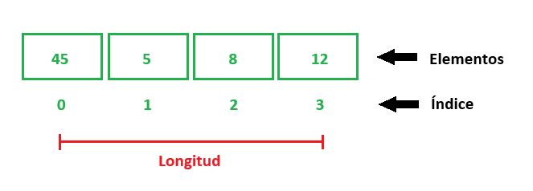

## Declaración

Podemos declarar un array de la siguiente manera:

```go
var a [n]T
```
Aquí, `n` es la longitud y `T` puede ser cualquier tipo como entero, string o estructuras definidas por el usuario.

Ahora, declaremos un array de enteros con longitud 4 e imprimámoslo.

```go
func main() {
    var arr [4]int

    fmt.Println(arr)
}
```

```bash
$ go run main.go
[0 0 0 0]
```

Por defecto, todos los elementos del array se inicializan con el valor cero del tipo correspondiente.

## Inicialización

También podemos inicializar un array usando un literal de array.

```go
var a [n]T = [n]T{V1, V2, ... Vn}
```

```go
func main() {
	var arr = [4]int{45, 5, 8, 12}

	fmt.Println(arr)
}
```

```bash
$ go run main.go
[45 5 8 12]
```

También podemos usar una declaración abreviada:

```go
...
arr := [4]int{45, 5, 8, 12}
```

## Acceso

Y de forma similar a otros lenguajes, podemos acceder a los elementos usando el índice, ya que están almacenados de manera secuencial.

```go
func main() {
	arr := [4]int{45, 5, 8, 12}

	fmt.Println(arr[0])
}
```

```bash
$ go run main.go
45
```

## Iteración

Ahora, hablemos de la iteración.

Existen varias formas de iterar sobre arrays.

La primera es usando un bucle for junto con la función `len`, que nos da la longitud del array.

```go
func main() {
	arr := [4]int{45, 5, 8, 12}

	for i := 0; i < len(arr); i++ {
		fmt.Printf("Índice: %d, Elemento: %d\n", i, arr[i])
	}
}
```

```bash
$ go run main.go
Índice: 0, Elemento: 45
Índice: 1, Elemento: 5
Índice: 2, Elemento: 8
Índice: 3, Elemento: 12
```

Otra forma es usar la palabra clave `range` con el bucle `for`.

```go
func main() {
	arr := [4]int{45, 5, 8, 12}

	for i, e := range arr {
        fmt.Printf("Índice: %d, Elemento: %d\n", i, e)
	}
}
```

```bash
$ go run main.go
Índice: 0, Elemento: 45
Índice: 1, Elemento: 5
Índice: 2, Elemento: 8
Índice: 3, Elemento: 12
```

Como podemos ver, nuestro ejemplo funciona igual que antes.

Pero la palabra clave `range` es bastante versátil y puede usarse de varias maneras:

```go
for i, e := range arr {} // Uso normal de range

for _, e := range arr {} // Omitir el índice con _ y usar solo el elemento

for i := range arr {} // Usar solo el índice


for range arr {} // Simplemente iterar sobre el array
```

## Multidimensional

Todos los arrays que hemos creado hasta ahora son unidimensionales. También podemos crear arrays multidimensionales en Go.

Veamos un ejemplo:

```go
func main() {
	arr := [3][4]int{
		{45, 5, 8, 12},
		{8, 7, 6, 5},
		{12, 11, 10, 9},
	}

	for i, e := range arr {
        fmt.Printf("Índice: %d, Elemento: %d\n", i, e)
	}
}
```

```bash
$ go run main.go
Índice: 0, Elemento: [45 5 8 12]
Índice: 1, Elemento: [8 7 6 5]
Índice: 2, Elemento: [12 11 10 9]
```

También podemos dejar que el compilador infiera la longitud del array usando `...` (puntos suspensivos) en lugar de especificar la longitud.


```go
func main() {
	arr := [...][4]int{
		{45, 5, 8, 12},
		{8, 7, 6, 5},
	}

	for i, e := range arr {
        fmt.Printf("Índice: %d, Elemento: %d\n", i, e)
	}
}
```

```bash
$ go run main.go
Índice: 0, Elemento: [45 5 8 12]
Índice: 1, Elemento: [8 7 6 5]
```

## Propiedades

Ahora hablemos de algunas propiedades de los arrays.

La longitud de un array forma parte de su tipo. Por lo tanto, los arrays `a` y `b` son tipos completamente distintos, y no podemos asignar uno al otro.

Esto también significa que no podemos redimensionar un array, porque hacerlo implicaría cambiar su tipo.

```go
package main

func main() {
	var a = [4]int{45, 5, 8, 12}
	var b [3]int = a // Error, no se puede usar a (tipo [5]int) como tipo [3]int en la asignación
}
```

Además, los arrays en Go son tipos por valor. Esto significa que, al asignarlos a otra variable o pasarlos como argumento a una función, se realiza una copia completa del array.

Como consecuencia, cualquier modificación realizada sobre la copia no afecta al array original.

Este comportamiento difiere de otros lenguajes como Java, donde los arrays son objetos y se manejan mediante referencias, y de lenguajes como C, donde los arrays suelen tratarse como punteros al pasarse a funciones.

```go
package main

import "fmt"

func main() {
	var a = [7]string{"Lun", "Mar", "Mie", "Jue", "Vie", "Sab", "Dom"}
	var b = a // Se asigna a b una copia de a

	b[0] = "Lunes"

	fmt.Println(a) // Salida: [Lun Mar Mie Jue Vie Sab Dom]
	fmt.Println(b) // Salida: [Lunes Mar Mie Jue Vie Sab Dom]
}
```

# Punteros

Ahora hablaremos de los tipos de datos de referencia. Los primeros que trataremos son los punteros. Pero, ¿qué son los punteros?

Simplemente, un puntero es una variable que se utiliza para almacenar la dirección de memoria de otra variable.

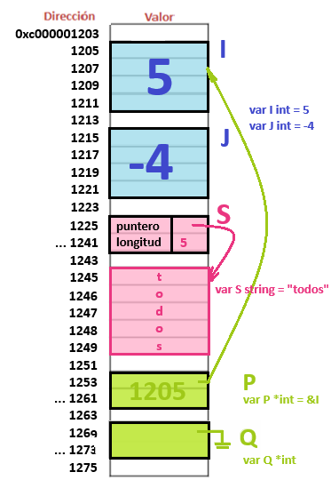

Se puede usar de la siguiente manera:

```go
var x *T
```

Donde `T` es el tipo, como `int`, `string`, `float`, y así sucesivamente.

Probemos un ejemplo sencillo para verlo en acción.

```go
package main

import "fmt"

func main() {
	var q *int

	fmt.Println(q)
}
```

```bash
$ go run main.go
nil
```

Hmm, esto imprime `nil`, pero ¿qué es `nil`?

Entonces, `nil` es un identificador predeclarado en Go que representa el valor cero para punteros, interfaces, canales, mapas y `slices` (estos últimos se verán justo a continuación).

Esto es igual a lo que aprendimos en la sección de variables y tipos de datos, donde vimos que un `int` no inicializado tiene un valor cero de 0, un `bool` tiene false, y así sucesivamente.

Bien, ahora asignemos un valor al puntero.


```go
package main

import "fmt"

func main() {
	var i int= 5

	var p *int = &i

	fmt.Println("dirección:", p)
}
```
Usamos el operador `&` para referirnos a la dirección de memoria de una variable.

```bash
$ go run main.go
0xc00001203
```

Este debe ser el valor de la dirección de memoria de la variable `i`.

## Dereferenciación

También podemos usar el operador asterisco `*` para recuperar el valor almacenado en la variable a la que apunta el puntero. Esto también se llama **dereferenciación**.

Por ejemplo, podemos acceder al valor de la variable `i` a través del puntero `p` usando ese operador asterisco `*`.


```go
package main

import "fmt"

func main() {
	var i int =5

	var p *int = &i

	fmt.Println("dirección:", p)
	fmt.Println("valor:", *p)
}
```

```bash
$ go run main.go
dirección: 0xc00001203
valor: 5
```

No solo podemos acceder a ese valor, sino también cambiarlo a través del puntero.

```go
package main

import "fmt"

func main() {
	var i int =5

	var p *int = &i

	fmt.Println("antes", i)
	fmt.Println("dirección:", p)

	*p = 8
	fmt.Println("después:", i)
}
```

```bash
$ go run main.go
antes 5
dirección: 0xc00001203
después: 8
```
¡Como véis, es bastante elegante!

## Punteros como argumentos de función

Los punteros también pueden usarse como argumentos de una función cuando necesitamos pasar datos por referencia.

Aquí tenéis un ejemplo:

```go
miFuncion(&a)
...

func miFuncion(ptr *int) {}
```

## Nueva función

Existe otra forma de inicializar un puntero. Podemos usar la función incorporada `new`, que toma un tipo como argumento, asigna suficiente memoria para alojar un valor de ese tipo y devuelve un puntero a él.

Aquí tenéis un ejemplo:

```go
package main

import "fmt"

func main() {
	p := new(int)
	*p = 6

	fmt.Println("valor", *p)
	fmt.Println("dirección", p)
}
```

```bash
$ go run main.go
valor 6
dirección 0xc00001253
```

## Punteros a un punteros

¿Podemos crear un puntero a un puntero? ¡La respuesta es sí! Sí, podemos.

```go
package main

import "fmt"

func main() {
	p := new(int)
	*p = 6

	p1 := &p

	fmt.Println("P valor", *p, " dirección", p)
	fmt.Println("P1 valor", *p1, " dirección", p)

	fmt.Println("Valor dereferenciado", **p1)
}
```

```bash
$ go run main.go
P valor 6  dirección 0xc0000be001
P1 valor 0xc0000be001  dirección 0xc0000be001
Valor dereferenciado 6
```

_Nota cómo el valor de `p1` coincide con la dirección de `p`._

También es importante saber que los punteros en Go no soportan **aritmética de punteros** como en C o C++. Esto es, la capacidad de realizar operaciones matemáticas (suma, resta, incremento, decremento) sobre punteros para navegar por la memoria.

```go
p1 := p * 2 // Error del compilador: operación inválida
```

Sin embargo, Go sí permite comparar dos punteros del mismo tipo para comparar si apuntan al mismo lugar mediante el operador `==`.

```go
p := &a
p1 := &a

fmt.Println(p == p1)
```

En este sentido Go es más seguro, ya que en C o C++ puedes hacer `p + 1000` y acceder a memoria inválida. Esto permite que Go evite:
* Desbordamientos de buffer
* Punteros "colgantes"
* Errores del garbage collector

## ¿Pero por qué?

Esto nos lleva a la pregunta del millón: ¿por qué necesitamos punteros?

No hay una respuesta definitiva, y los punteros son simplemente otra característica útil que nos ayuda a modificar nuestros datos de manera eficiente sin copiar grandes cantidades de datos.

Finalmente, añadiré que si vienes de un lenguaje sin noción de punteros, no entres en pánico e intenta formar un modelo mental de cómo funcionan los punteros.

# Slices

Sigamos con otro tipo de dato de referencia: los slices. Pero, ¿qué es un slice?

Un slice es una vista dinámica sobre un array. A diferencia de los arrays, los slices **no tienen un tamaño fijo**, por lo que son mucho más flexibles.

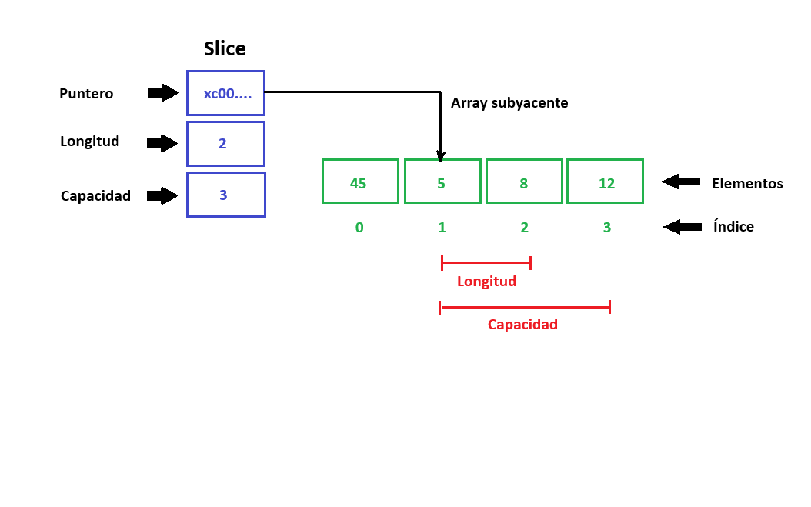

Un slice consta de tres cosas:

- Un puntero (referencia) a un array subyacente.
- La longitud del segmento del array que contiene el slice.
- Y la capacidad, que es el tamaño máximo hasta el que ese segmento puede crecer.

Al igual que la función `len`, podemos determinar la capacidad de un slice usando la función incorporada `cap`. Aquí tienes un ejemplo:

```go
package main

import "fmt"

func main() {
	a := [4]int{45, 5, 8, 12}

	s := a[1:3]

	// Salida: Array: [45 5 8 12], Longitud: 4, Capacidad: 4
	fmt.Printf("Array: %v, Longitud: %d, Capacidad: %d\n", a, len(a), cap(a))

	// Output: Slice [5 8], Length: 2, Capacity: 3
	fmt.Printf("Slice: %v, Longitud: %d, Capacidad: %d", s, len(s), cap(s))
}
```

No te preocupes, vamos a explicar todo esto en detalle.

## Declaración

Veamos cómo podemos declarar un slice.

```go
var s []T
```

Como puedes ver, no necesitamos especificar ninguna longitud. Vamos a declarar un slice de strings y ver cómo funciona.

```go
func main() {
	var s []string

	fmt.Println(s)
	fmt.Println(s == nil)
}
```

```bash
$ go run main.go
[]
true
```

Así que, a diferencia de los arrays, el valor por defecto o valor cero de un slice es `nil`.

## Inicialización

Existen varias formas de inicializar un slice. Una de ellas es usando la función incorporada `make`.

```go
make([]T, len, cap) []T
```

```go
func main() {
	var s = make([]string, 0, 0)

	fmt.Println(s)
}
```

```bash
$ go run main.go
[]
```

Al igual que con los arrays, podemos usar un literal de slice para inicializarlo.

```go
func main() {
	var s = []string{"Enero", "Febrero"}

	fmt.Println(s)
}
```

```bash
$ go run main.go
[Enero Febrero]
```

Otra forma es crear un slice a partir de un array. Como un slice es un segmento de un array, podemos crearlo desde el índice `bajo` hasta `alto` de la siguiente manera:

```go
a[bajo:alto]
```

```go
func main() {
	var a = [4]string{
		"Enero",
		"Febrero",
		"Marzo",
		"Abril",
	}

	s1 := a[0:2] // Selecciona desde 0 hasta 2
	s2 := a[:3]  // Selecciona los primeros 3
	s3 := a[2:]  // Selecciona los últimos 2

	fmt.Println("Array:", a)
	fmt.Println("Slice 1:", s1)
	fmt.Println("Slice 2:", s2)
	fmt.Println("Slice 3:", s3)
}
```

```bash
$ go run main.go
Array: [Enero Febrero Marzo Abril]
Slice 1: [Enero Febrero]
Slice 2: [Enero Febrero Marzo]
Slice 3: [Marzo Abril]
```

_La ausencia del índice inferior implica 0 y la ausencia del índice superior implica la longitud del array subyacente (`len(a)`)._

Algo importante a tener en cuenta es que también podemos crear un slice a partir de otros slices, no solo de arrays.

```go
var a = []string{
	"Enero",
	"Febrero",
	"Marzo",
	"Abril",
}
```

## Iteración

Podemos iterar sobre un slice de la misma forma que iteramos sobre un array, usando un bucle con la función `len` o palabra clave `range`.

## Funciones

Ahora, veamos algunas funciones incorporadas para slices en Go.

**copy**

La función `copy()`copia elementos de un slice a otro. Recibe 2 slices: uno de destino y otro de origen. También devuelve el número de elementos copiados.

```go
func copy(dst, src []T) int
```

Veamos cómo usarla:

```go
func main() {
	s1 := []string{"a", "b", "c", "d", "e"}
	s2 := make([]string, len(s1))

	e := copy(s2, s1)

    fmt.Println("Origen:", s1)
    fmt.Println("Destino:", s2)
    fmt.Println("Elementos:", e)
}
```

```bash
$ go run main.go
Origen: [a b c d e]
Destino: [a b c d e]
Elementos: 5
```

Como era de esperar, los 5 elementos del slice origen fueron copiados al slice destino.

**append**

Ahora veamos cómo añadir datos a un slice usando la función incorporada `append`, que agrega nuevos elementos al final de un slice.

Recibe un slice y un número variable de argumentos, y devuelve un nuevo slice con todos los elementos.

```go
append(slice []T, elems ...T) []T
```

Probemos un ejemplo añadiendo elementos a un slice:

```go
func main() {
	s1 := []string{"a", "b", "c", "d", "e"}

	s2 := append(s1, "f", "g")

	fmt.Println("s1:", s1)
	fmt.Println("s2:", s2)
}
```

```bash
$ go run main.go
s1: [a b c d e]
s2: [a b c d e f g]
```

Como podemos ver, los nuevos elementos se añadieron y se devolvió un nuevo slice.

Pero si el slice original no tiene suficiente capacidad para los nuevos elementos, entonces se crea un nuevo array subyacente con mayor capacidad.

Todos los elementos del array subyacente del slice original se copian a este nuevo array, y luego se añaden los nuevos elementos.

## Propiedades

Finalmente, veamos algunas propiedades de los slices.

Los slices son tipos por referencia, a diferencia de los arrays.

Esto significa que modificar los elementos de un slice también modificará los elementos correspondientes en el array al que hace referencia.

```go
package main

import "fmt"

func main() {
	a := [7]string{"Lun", "Mar", "Mie", "Jue", "Vie", "Sab", "Dom"}

	s := a[0:2]

	s[0] = "Dom"

	fmt.Println(a) // Salida: [Dom Mar Mie Jue Vie Sab Dom]
	fmt.Println(s) // Output: [Dom Mar]
}
```

Los slices también pueden usarse con parámetros variádicos.

```go
package main

import "fmt"

func main() {
	values := []int{1, 2, 3}
	sum := add(values...)
	fmt.Println(sum)
}

func add(values ...int) int {
	sum := 0
	for _, v := range values {
		sum += v
	}

	return sum
}
```

# Maps

El último tipo de datos de referencia que proporciona Go es un tipo de dato llamado `map`, y vamos a aprender cómo usarlo.

Pero la pregunta es: ¿qué son los `maps`? ¿Y por qué los necesitamos?

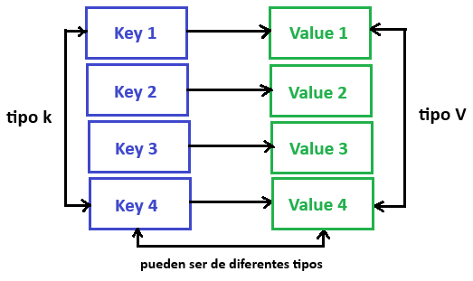

Un `map` es una colección desordenada de pares clave-valor. Asocia claves con valores. Las claves son únicas dentro de un map, mientras que los valores no necesariamente lo son.

Se utiliza para búsquedas rápidas, recuperación y eliminación de datos basados en claves. Es una de las estructuras de datos más utilizadas.

## Declaración

Empecemos con la declaración.

Un map se declara usando la siguiente sintaxis:

```go
var m map[K]V
```
Donde `K` es el tipo de la clave y `V` es el tipo del valor.

Por ejemplo, así podemos declarar un map con claves de tipo `string` y valores de tipo `int`:

```go
func main() {
	var m map[string]int

	fmt.Println(m)
}
```

```bash
$ go run main.go
nil
```

Como podemos ver, el valor cero (zero value) de un map es `nil`.

Un map `nil` no tiene claves. Además, cualquier intento de añadir claves a un map `nil` provocará un error en tiempo de ejecución.

## Inicialización

Existen varias formas de inicializar un map.

**función make**

Podemos usar la función incorporada `make`, que reserva memoria para tipos de datos por referencia e inicializa sus estructuras de datos subyacentes.

```go
func main() {
	var m = make(map[string]int)

	fmt.Println(m)
}
```

```bash
$ go run main.go
map[]
```

**literal de map**

Otra forma es usando un literal de map.

```go
func main() {
	var m = map[string]int{
		"a": 0,
        "b": 1,
	}

	fmt.Println(m)
}
```

_Nota: la coma final es obligatoria._

```bash
$ go run main.go
map[a:0 b:1]
```

Como siempre, también podemos usar nuestros propios tipos personalizados.

```go
type Usuario struct {
	Name string
}

func main() {
	var m = map[string]Usuario{
		"a": Usuario{"Pedro"},
		"b": Usuario{"Sebastián"},
	}

	fmt.Println(m)
}
```

Incluso podemos omitir el tipo del valor y Go lo inferirá automáticamente:

```go
var m = map[string]Usuario{
	"a": {"Pedro"},
	"b": {"Sebastián"},
}
```

```bash
$ go run main.go
map[a:{Pedro} b:{Sebastián}]
```

## Añadir

Ahora veamos cómo podemos añadir un valor a nuestro map.

```go
func main() {
	var m = map[string]Usuario{
		"a": {"Pedro"},
		"b": {"Sebastián"},
	}

	m["c"] = Usuario{"Manuel"}

	fmt.Println(m)
}
```

```bash
$ go run main.go
map[a:{Pedro} b:{Sebastián} c:{Manuel}]
```

## Recuperar

También podemos obtener valores del map usando su clave.

```go
...
c := m["c"]
fmt.Println("Clave c:", c)
```

```bash
$ go run main.go
key c: {Manuel}
```

**¿Qué pasa si usamos una clave que no existe en el map?**

```go
...
d := m["d"]
fmt.Println("Clave d:", d)
```

Como ya habrás imaginado, obtendremos el valor cero (zero value) del tipo de valor del map.

```bash
$ go run main.go
Key c: {Manuel}
Key d: {}
```

## Existencia

Cuando recuperas el valor asignado a una clave determinada, también se devuelve un valor booleano adicional. La variable booleana será `true` si la clave existe, y `false` en caso contrario.

Probemos esto con un ejemplo:

```go
...
c, ok := m["c"]
fmt.Println("Clave c:", c, ok)

d, ok := m["d"]
fmt.Println("Clave d:", d, ok)
```

```bash
$ go run main.go
Clave c: {Manuel} true
Clave d: {} false
```

## Actualización

También podemos actualizar el valor de una clave simplemente reasignándola.

```go
...
m["a"] = "Roberto"
```

```bash
$ go run main.go
map[a:{Roberto} b:{Sebastián} c:{Manuel}]
```

## Eliminación

O bien, podemos eliminar una clave usando la función incorporada `delete`.

Así es como se ve la sintaxis:

```go
...
delete(m, "a")
```

El primer argumento es el mapa, y el segundo es la clave que queremos eliminar.

La función `delete()` no devuelve ningún valor. Además, no hace nada si la clave no existe en el mapa.

```bash
$ go run main.go
map[a:{Roberto} c:{Sebastián}]
```

## Iteración

Al igual que con los arrays o slices, podemos iterar sobre mapas usando la palabra clave `range`.

```go
package main

import "fmt"

func main() {
	var m = map[string]Usuario{
		"a": {"Pedro"},
		"b": {"Sebastián"},
	}

	m["c"] = Usuario{"Manuel"}

	for key, value := range m {
		fmt.Println("Clave: %s, Valor: %v", key, value)
	}
}
```

```bash
$ go run main.go
Clave: c, Valor: {Manuel}
Clave: a, Valor: {Pedro}
Clave: b, Valor: {Sebastián}
```

Ten en cuenta que un mapa es una colección no ordenada, y por lo tanto el orden de iteración no está garantizado y puede variar cada vez.

## Propiedades

Por último, hablemos de las propiedades de los mapas.

Los mapas son tipos por referencia, lo que significa que cuando asignamos un mapa a una nueva variable, ambas se refieren a la misma estructura de datos subyacente.

Por lo tanto, los cambios realizados por una variable serán visibles para la otra.

```go
package main

import "fmt"

type Usuario struct {
	Name string
}

func main() {
	var m1 = map[string]Usuario{
		"a": {"Pedro"},
		"b": {"Sebastián"},
	}

	m2 := m1
	m2["c"] = Usuario{"Manuel"}

	fmt.Println(m1) // Output: map[a:{Pedro} b:{Sebastián} c:{Manuel}]
	fmt.Println(m2) // Output: map[a:{Pedro} b:{Sebastián} c:{Manuel}]
}
```

# Interfaces

En esta sección, vamos a hablar sobre las interfaces.

## ¿Qué es una interfaz?

Una interfaz en Go es un **tipo abstracto** que se define mediante un conjunto de firmas de métodos. La interfaz define el **comportamiento** de tipos de objetos similares.

_Aquí, **comportamiento** es un término clave que veremos en breve._

Veamos un ejemplo para entenderlo mejor.

Imagina un **control remoto** que puede usarse con distintos dispositivos:

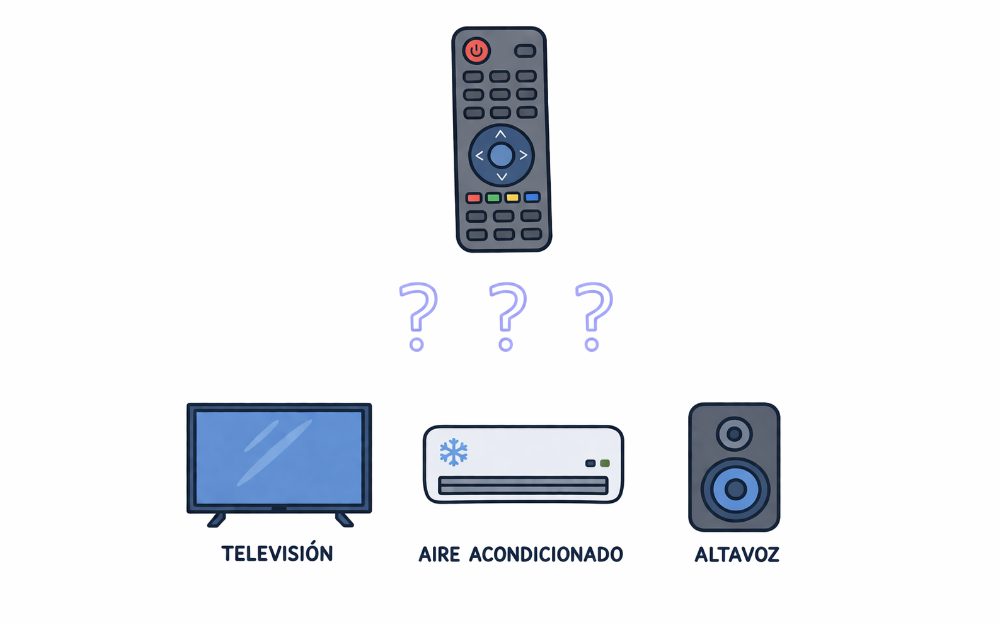

Todos son diferentes, pero comparten el mismo comportamiento:

Intentemos implementar esto. Estos son los tipos de dispositivos que vamos a usar.

```go
type television struct {
    brand string
}

type aireAcondicionado struct {
    mode string
}

type altavoz struct {
    power int
}

type controlRemoto struct{}
```

Ahora definimos un método, por ejemplo `Encender`, sobre el tipo `television`. Aquí simplemente imprimimos las propiedades del dispositivo:

```go
func (t television) Encender(power int) {
    fmt.Printf("%T -> marca: %s, potencia: %d\n", t, t.brand, power)
}
```

Perfecto, ahora definimos el método `Usar` en el tipo `controlRemoto`, que recibe una televisión como argumento.

```go
func (controlRemoto) Usar(device television, power int) {
    device.Encender(power)
}
```
Intentemos ahora _“usar”_ la `televisión` con nuestro `controlRemoto` en la función `main`.

```go
package main

import "fmt"

func main() {
	tv := television{"Samsung"}
	
	rc := remoteControl{}
	rc.Usar(tv, 10)
}
```

Y si ejecutamos esto, veremos lo siguiente:

```bash
$ go run main.go
main.television -> marca: Samsung, potencia: 10
```

Esto funciona bien, pero ahora supongamos que queremos `Usar` también el `aireAcondicionado`.

```go
package main

import "fmt"

func main() {
	tv := television{"Samsung"}
	ac := airConditioner{"frío"}
	
	rc := remoteControl{}
	rc.Usar(tv, 10)
	rc.Usar(ac, 20) // Error: no se puede usar ac como television
}
```

Como podemos ver, esto produce un error. Esto ocurre porque el método `Usar` solo acepta `television`, no otros dispositivos. El control remoto solo funciona con televisores, no es genérico por lo que tenemos un **problema**.

Esto es exactamente el punto donde entran las interfaces.

**¿Qué deberíamos hacer ahora? ¿Definir otro método? Como `UsarAireAcondicionado`?**

Claro, pero entonces cada vez que añadamos un nuevo tipo de dispositivo tendríamos que añadir también un nuevo método al tipo `controlRemoto`, y eso no es lo ideal.

Aquí es donde entra la **interfaz**. Básicamente, queremos definir un **contrato** que, a partir de ese momento, deba implementarse.

Podemos definir simplemente una interfaz, por ejemplo `Controlable`, y usarla en nuestro método `Usar` para permitir cualquier dispositivo que cumpla el requisito, es decir, que el tipo tenga un método `Encender` con la firma que exige la interfaz.

Y además, el control remoto no necesita saber nada más sobre el dispositivo; simplemente puede llamar al método `Encender`.

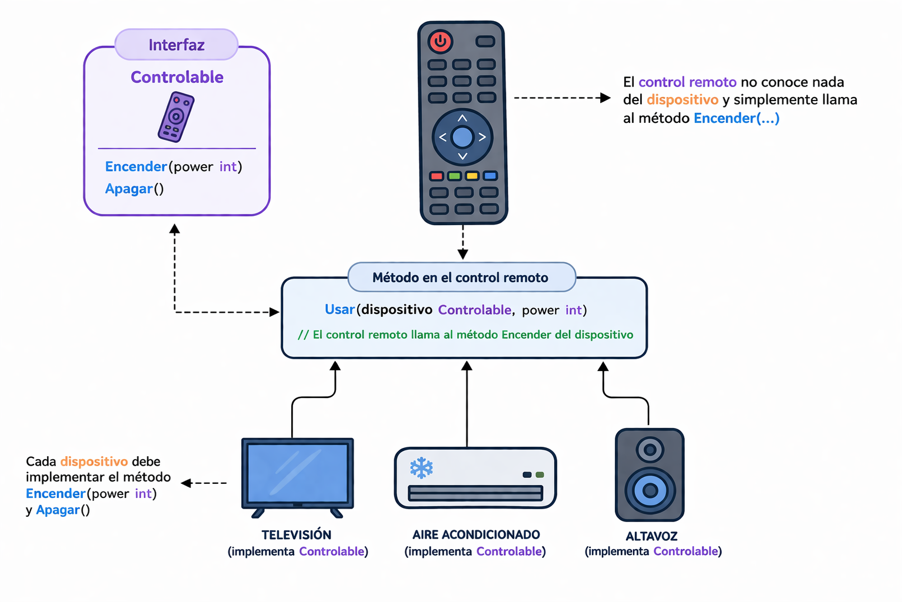

Ahora vamos a intentar implementar nuestra interfaz `Controlable`. Así es como se vería.

La convención es usar el sufijo **"-er"** en el nombre. Y como comentamos antes, una interfaz solo debe describir el comportamiento esperado. En nuestro caso, ese comportamiento es el método `Encender` (y opcionalmente `Apagar`).

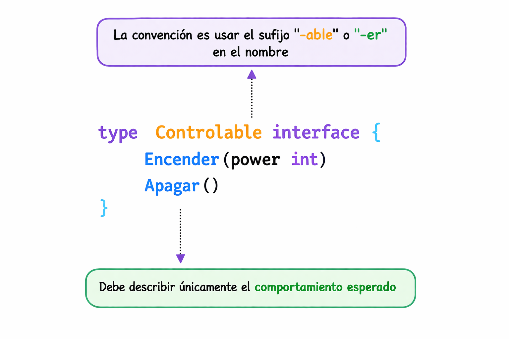

```go
type Controlable interface {
    Encender(power int)
    Apagar()
}
```

Ahora necesitamos actualizar nuestro método `Usar` para que acepte un dispositivo que implemente la interfaz `Controlable`.

```go
func (controlRemoto) Usar(device Controlable, power int) {
    device.Encender(power)
}
```

Para cumplir la interfaz, simplemente añadimos los métodos `Encender` (y `Apagar`) a todos los dispositivos.

```go
type television struct {
    brand string
}

func (t television) Encender(power int) {
    fmt.Printf("%T -> marca: %s, potencia: %d\n", t, t.brand, power)
}

func (t television) Apagar() {
    fmt.Println("Televisión apagada")
}

type aireAcondicionado struct {
    mode string
}

func (a aireAcondicionado) Encender(power int) {
    fmt.Printf("%T -> modo: %s, potencia: %d\n", a, a.mode, power)
}

func (a aireAcondicionado) Apagar() {
    fmt.Println("Aire acondicionado apagado")
}

type altavoz struct {
    volume int
}

func (s altavoz) Encender(power int) {
    fmt.Printf("%T -> volumen: %d, potencia: %d\n", s, s.volume, power)
}

func (s altavoz) Apagar() {
    fmt.Println("Altavoz apagado")
}
```

Ahora podemos usar todos los dispositivos con el control remoto gracias a la interfaz.

```go
func main() {
  tv := television{"Samsung"}
  ac := aireAcondicionado{"frío"}
  sp := altavoz{20}
  
  rc := controlRemoto{}
  
  rc.Usar(tv, 10)
  rc.Usar(ac, 20)
  rc.Usar(sp, 15)
}
```

El resultado es el siguiente:

```bash
$ go run main.go
main.television -> marca: Samsung, potencia: 10
main.aireAcondicionado -> modo: frío, potencia: 20
main.altavoz -> volumen: 20, potencia: 15
```

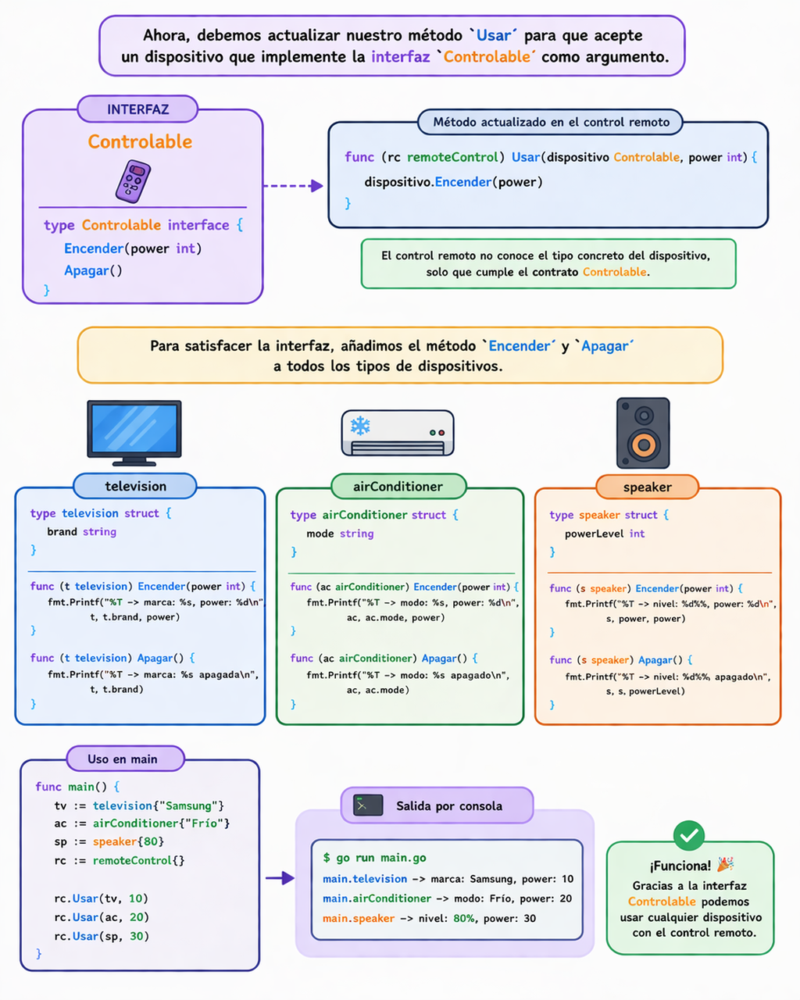

**¿Pero por qué se considera un concepto tan poderoso?**

Bueno, una interfaz puede ayudarnos a desacoplar nuestros tipos. Por ejemplo, gracias a la interfaz, no necesitamos modificar la implementación de nuestro `controlRemoto`. Simplemente podemos definir un nuevo tipo de dispositivo con un método `Encender`.

A diferencia de otros lenguajes, las interfaces en Go se implementan de forma implícita, por lo que no necesitamos algo como la palabra clave **implements**. Esto significa que un tipo satisface una interfaz automáticamente cuando tiene todos los métodos que la interfaz define.

## Interfaz vacía

Ahora hablemos de la interfaz vacía. Una interfaz vacía puede contener un valor de cualquier tipo.

Así es como se declara:

```go
var x interface{}
```

**¿Pero para qué sirve?**

Las interfaces vacías se pueden usar para manejar valores de tipo desconocido.

Algunos ejemplos son:

- Leer datos heterogéneos de una API.
- Variables de tipo desconocido, como en la función `fmt.Println`.

Para usar un valor de tipo `interface{}` vacío, podemos emplear una _aserción de tipo_ o un _switch de tipo_ para determinar el tipo del valor.

## Asertion de tipo

Una _aserción de tipo_ permite acceder al valor concreto subyacente de una interfaz.

Por ejemplo:

```go
func main() {
	var i interface{} = "hola"

	s := i.(string)
	fmt.Println(s)
}
```

Esta instrucción afirma que el valor de la interfaz contiene un tipo concreto y asigna ese valor a la variable.

También podemos comprobar si un valor de una interfaz contiene un tipo específico.

Una aserción de tipo puede devolver dos valores:

- El primero es el valor subyacente.
- El segundo es un booleano que indica si la conversión fue exitosa.

```go
s, ok := i.(string)
fmt.Println(s, ok)
```

Esto nos ayuda a verificar si la interfaz contiene un tipo concreto o no.

Esto es similar a cómo leemos valores de un mapa.

Si no es el caso:
- `ok` será `false`
- el valor será el valor cero del tipo
- no ocurrirá ningún error

```go
f, ok := i.(float64)
fmt.Println(f, ok)
```

Pero si la interfaz no contiene ese tipo y no usamos el booleano, se producirá un error:

```go
f = i.(float64)
fmt.Println(f) // error!
```

```bash
$ go run main.go
hola
hola true
0 false
panic: interface conversion: interface {} is string, not float64
```

## Switch de tipo

Un _switch de tipo_ en Go es una construcción que se usa para **saber qué tipo concreto** tiene un valor almacenado en una interfaz, especialmente en una `interface{}` vacía.

Sirve para tratar distintos tipos de forma diferente dentro del mismo bloque de código.

Si una variable puede contener valores de varios tipos, el switch de tipo te permite preguntar:
- ¿es un string?
- ¿es un int?
- ¿es un bool?

Veamos un ejemplo:


```go
var t interface{}
t = "hola"

switch t := t.(type) {
case string:
	fmt.Printf("string: %s\n", t)
case bool:
	fmt.Printf("boolean: %v\n", t)
case int:
	fmt.Printf("integer: %d\n", t)
default:
	fmt.Printf("unexpected: %T\n", t)
}
```

Y si lo ejecutamos, podremos verificar que tenemos un tipo `string`.

```bash
$ go run main.go
string: hola
```

En resumen, es una forma elegante de **desempaquetar** una interfaz y actuar según el tipo real del valor.

## Propiedades

Hablemos de algunas propiedades de las interfaces.

### Valor por defecto o valor cero

El valor por defecto o valor cero de una interfaz es `nil`.

```go
package main

import "fmt"

type MiInterfaz interface {
	Metodo()
}

func main() {
	var i MiInterfaz
	
	fmt.Println(i) // Salida: <nil>
}
```

### Embedding

Podemos embeber interfaces como hacemos con structs. Por ejemplo:

```go
type interfaz1 interface {
    Metodo1()
}

type interfaz2 interface {
    Metodo2()
}

type interfaz3 interface {
    interfaz1
    interfaz2
}
```

### Valores

Los valores de interfaz son comparables.

```go
package main

import "fmt"

type MiInterfaz interface {
	Metodo()
}

type MiTipo struct{}

func (MiTipo) Metodo() {}

func main() {
	t := MiTipo{}
	var i MiInterfaz = MiTipo{}
	
	fmt.Println(t == i)  // true
}
```

### Valores de interfaz

Por debajo, un valor de interfaz se puede pensar como una **tupla** que consiste en un **valor** y un **tipo concreto**.

```go
package main

import "fmt"

type MiInterfaz interface {
	Metodo()
}

type MiTipo struct {
	propiedad int
}

func (MiTipo) Metodo() {}

func main() {
	var i MiInterfaz
	
	i = MiTipo{10}
	
	fmt.Printf("(%v, %T)\n", i, i)  // Salida: ({10}, main.MiTipo)
}
```

¡Con esto hemos cubierto las interfaces en Go!

Es una característica muy potente, pero recuerda: _"A mayor interfaz, menor abstracción"_.

# Manejo de errores

Hablemos ahora del manejo de errores.

Observa que dije errores y no excepciones, porque Go no tiene manejo de excepciones.

En su lugar, simplemente devolvemos un tipo `error`, que es un tipo de interfaz:

```go
type error interface {
    Error() string
}
```

Volveremos a esto más adelante. Primero, entendamos los conceptos básicos.

Declaramos una función simple `Divide` que, como su nombre indica, dividirá el entero `a` entre `b`.


```go
func Divide(a, b int) int {
	return a/b
}
```

Perfecto. Ahora queremos devolver un error, por ejemplo, para evitar la división por cero. Esto nos lleva a la construcción de errores.

## Construcción de errores

Hay varias formas de hacerlo, pero veremos las dos más comunes.

### Paquete `errors`

La primera es usando la función `New` del paquete `errors`:

```go
package main

import "errors"

func main() {}

func Divide(a, b int) (int, error) {
	if b == 0 {
		return 0, errors.New("no se puede dividir por cero")
	}

	return a/b, nil
}
```

Notar que devolvemos un error junto al resultado. Si no hay error, devolvemos `nil` (valor cero de interfaces).

¿Cómo manejarlo? Llamamos la función `Divide` desde la función `main`:

```go
package main

import (
	"errors"
	"fmt"
)

func main() {
	resultado, err := Divide(4, 0)

	if err != nil {
		fmt.Println(err) //Manejar error
		
		return
	}

	fmt.Println(resultado) // Usar resultado
}

func Divide(a, b int) (int, error) {...}
```

```bash
$ go run main.go
no se puede dividir por cero
```

Como podemos ver, simplemente verificamos `err != nil` y construimos la lógica en consecuencia. Esto se conoce como **Go Idiomático**.

Otra forma es `fmt.Errorf`, similar a la función `fmt.Sprintf ` pero devuelve `error`:


```go
...
func Divide(a, b int) (int, error) {
	if b == 0 {
		return 0, fmt.Errorf("no se puede dividir %d por cero", a)
	}

	return a/b, nil
}
```

Debería funcionar de manera similar.

```bash
$ go run main.go
no se puede dividir 4 por cero
```

### Errores centinela

Otra técnica importante en Go es definir **errores esperados** para poder verificarlos explícitamente en otras partes del código. A estos se les llama **errores centinela**.

```go
package main

import (
	"errors"
	"fmt"
)

var ErrDividirPorCero = errors.New("no se puede dividir por cero")

func main() {...}

func Divide(a, b int) (int, error) {
	if b == 0 {
		return 0, ErrDividirPorCero
	}

	return a/b, nil
}
```

En Go, se considera convencional usar el prefijo `Err` en la variable (ej. `ErrNotFound`).

**¿Cuál es la ventaja?**

Es útil cuando necesitamos ejecutar **ramas de código diferentes** según el tipo de error (usando la función `errors.Is`):

```go
package main

import (
	"errors"
	"fmt"
)

func main() {
	resultado, err := Divide(4, 0)

	if err != nil {
		switch {
		case errors.Is(err, ErrDividirPorCero):
			fmt.Println("Error específico:", err)
			// Acción específica para división por cero
		default:
			fmt.Println("¡Error desconocido!")
		}
		return
	}
	fmt.Println("Resultado:", resultado)
}

func Divide(a, b int) (int, error) {...}
```

```bash
$ go run main.go
Error específico: no se puede dividir por cero
```

## Errores personalizados

Esta estrategia cubre la mayoría de casos de manejo de errores. Pero a veces necesitamos **valores dinámicos** dentro de nuestros errores.

Recordemos que `error` es solo una interfaz. Cualquier cosa puede ser `error` si implementa el método `Error()` que devuelve un string.

Definamos ahora nuestro `DivisionError`. Para ellos creamos un struct personalizado con código de error y mensaje:

```go
package main

import (
	"errors"
	"fmt"
)

type DivisionError struct {
	Code int
	Msg  string
}

func (d DivisionError) Error() string {
	return fmt.Sprintf("código %d: %s", d.Code, d.Msg)
}

func main() {...}

func Divide(a, b int) (int, error) {
	if b == 0 {
		return 0, DivisionError{
			Code: 2000,
			Msg:  "no se puede dividir por cero",
		}
	}

	return a/b, nil
}
```

Aquí usaremos `errors.As` en lugar de la función `errors.Is` para convertir el error al tipo correcto.

```go
func main() {
	resultado, err := Divide(4, 0)

	if err != nil {
		var divErr DivisionError

		switch {
		case errors.As(err, &divErr):
			fmt.Printf("Error: %s (Código: %d)\n", divErr.Msg, divErr.Code)
			// Acción específica con el error
		default:
			fmt.Println("¡Error desconocido!")
		}

		return
	}
    fmt.Println("Resultado:", resultado)
}

func Divide(a, b int) (int, error) {...}
```

```bash
$ go run main.go
Error: no se puede dividir por cero (Código: 2000)
```

**¿Pero, cuál es la diferencia entre `errors.Is` y `errors.As`?**

La diferencia es que esta función verifica si el error tiene un tipo específico, a diferencia de la función [`Is`](https://pkg.go.dev/errors#Is), que examina si es un objeto de error particular.

Finalmente, diré que el manejo de errores en Go es bastante diferente al paradigma tradicional try/catch de otros lenguajes. Pero es muy poderoso porque fomenta al desarrollador a manejar el error de forma explícita, lo que mejora la legibilidad del código.

# Panic y Recover

Como vimos antes, la forma idiomática de manejar condiciones anómalas en un programa Go es mediante errores. Aunque los errores son suficientes en la mayoría de los casos, hay situaciones en las que el programa no puede continuar.

En esos casos, podemos usar la función incorporada `panic`.

## Panic

```go
func panic(interface{})
```

`panic` es una función incorporada que detiene la ejecución normal de la `goroutine` actual. Cuando una función llama a `panic`, la ejecución normal de esa función se detiene inmediatamente y el control se devuelve al llamador. Este proceso se repite hasta que el programa termina mostrando el mensaje de panic y la traza de la pila (_stack trace_).

_Nota: Veremos las `goroutines` más adelante en el curso._

Veamos cómo podemos usar la función `panic`.

```go
package main

func main() {
	WillPanic()
}

func WillPanic() {
	panic("Woah")
}
```

Y si ejecutamos esto, podemos ver `panic` en acción:

```bash
$ go run main.go
panic: Woah

goroutine 1 [running]:
main.WillPanic(...)
        .../main.go:8
main.main()
        .../main.go:4 +0x38
exit status 2
```

Como era de esperar, nuestro programa imprimió el mensaje de panic, seguido de la traza de la pila, y luego terminó su ejecución.

Entonces, la pregunta es: ¿qué hacer cuando ocurre un panic inesperado?

## Recover

Es posible recuperar el control de un programa que ha entrado en _panic_ usando la función incorporada `recover`, junto con la palabra clave `defer`.
```go
func recover() interface{}
```

Veamos un ejemplo creando una función `handlePanic`. Luego podemos llamarla usando `defer`.

```go
package main

import "fmt"

func main() {
	WillPanic()
}

func handlePanic() {
	data := recover()
	fmt.Println("Recuperado:", data)
}

func WillPanic() {
	defer handlePanic()

	panic("Woah")
}
```

```bash
$ go run main.go
Recuperado: Woah
```

Como podemos ver, el _panic_ fue recuperado y ahora nuestro programa puede continuar su ejecución.

Por último, cabe mencionar que `panic` y `recover` pueden considerarse similares al patrón `try/catch` en otros lenguajes. Pero un punto importante es que debemos evitar usar `panic` y `recover` siempre que sea posible y utilizar **errores** en su lugar.

Entonces, surge la pregunta: ¿cuándo deberíamos usar `panic`?

## Casos de uso

Existen dos casos válidos para usar `panic`:

- **Un error irrecuperable**

Es una situación en la que el programa no puede continuar su ejecución.

Por ejemplo, al leer un archivo de configuración necesario para iniciar el programa, ya que no hay nada más que hacer si la lectura del archivo falla.

- **Error del desarrollador**

Es la situación más común. Por ejemplo, desreferenciar un puntero cuyo valor es `nil` provocará un _panic_.

# Testing

Ahora hablaremos sobre el testing en Go. Empecemos con un ejemplo sencillo.

Supongamos que tenemos un paquete llamado `utils` que contiene una función `Multiply`, encargada de multiplicar dos números enteros.

Hemos creado un paquete `math` que contiene una función `Add` que, como su nombre indica, suma dos enteros.

```go
package utils

func Multiply(a, b int) int {
	return a * b
}
```

Podemos usar esta función en nuestro programa principal:

```go
package main

import (
	"example/utils"
	"fmt"
)

func main() {
	result := utils.Multiply(3, 4)
	fmt.Println(result)
}

```

Si ejecutamos el programa:

```bash
$ go run main.go
12
```
Para probar esta función `Multiply`, creamos un archivo de test con el sufijo `_test.go`.

```bash
.
├── go.mod
├── main.go
└── utils
    ├── multiply.go
    └── multiply_test.go
```

Comenzaremos utilizando el paquete `utils_test` e importando el paquete `testing` de la librería estándar. ¡Así es! Go ya incluye herramientas de testing integradas, a diferencia de muchos otros lenguajes.

Pero… ¿por qué usar `utils_test` como paquete? ¿No podríamos usar directamente el paquete `utils`?

Sí, podríamos escribir los tests en el mismo paquete si quisiéramos. Sin embargo, hacerlo en un paquete separado nos ayuda a mantener los tests más desacoplados del código original.

Ahora podemos crear nuestra función `TestMultiply`. Esta recibirá un argumento de tipo `testing.T`, que nos proporciona métodos útiles para verificar los resultados de nuestras pruebas.

```go
package utils_test

import "testing"

func TestMultiply(t *testing.T) {}
```
Antes de añadir lógica de prueba, vamos a intentar ejecutar los tests. Esta vez no utilizamos el comando `go run`, sino `go test`.

```bash
$ go test ./utils
ok      example/utils    0.3s
```

Aquí estamos ejecutando los tests del paquete `utils`. También podemos usar la ruta relativa `./...` para ejecutar los tests de todos los paquetes del proyecto.

```bash
$ go test ./...
?       example [no test files]
ok      example/utils    0.3s
```

Si Go no encuentra tests en algún paquete, nos lo indicará.

Perfecto, ahora vamos a escribir código de prueba. Para ello, comparamos el resultado obtenido con el valor esperado. Si no coinciden, podemos usar métodos como `t.Errorf` para marcar el test como fallido.

```go
package utils_test

import (
	"example/utils"
	"testing"
)

func TestMultiply(t *testing.T) {
	result := utils.Multiply(2, 3)
	expected := 6
	
	if result != expected {
		t.Errorf("esperado %d pero obtenido %d", expected, result)
	}
}
```

¡Genial! Nuestro test se ejecuta correctamente y pasa sin errores.

```bash
$ go test utils
ok      example/utils    0.3s
```

Ahora veamos qué ocurre cuando un test falla. Para ello, basta con cambiar el valor esperado en nuestro test.

```go
package utils_test

import (
  "example/utils"
  "testing"
)

func TestMultiply(t *testing.T) {
  result := utils.Multiply(2, 3)
  expected := 5

  if result != expected {
    t.Fail()
  }
}
```

```bash
$ go test ./utils
ok      example/utils    (cached)
```

Si ves esto, no te preocupes. Por motivos de optimización, Go almacena en caché los resultados de los tests. Para forzar su ejecución nuevamente, podemos limpiar la caché:

```bash
$ go clean -testcache
$ go test ./utils
--- FAIL: TestMultiply (0.00s)
FAIL
FAIL    example/utils    0.3s
FAIL
```

Así es como se ve un test fallido.

## Table-driven tests (tests basados en tablas)

Esto nos lleva a los _table-driven tests_. ¿Pero qué son exactamente?

Antes comparábamos directamente los argumentos de la función con un único valor esperado. Pero, ¿y si definimos varios casos de prueba en una estructura y los recorremos? Esto hace que nuestros tests sean más flexibles y nos permite probar múltiples casos fácilmente.

Vamos a verlo con un ejemplo. Primero definimos una estructura `multiplyTestCase`.

```go
package utils_test

import (
  "example/utils"
  "testing"
)

type multiplyTestCase struct {
  a, b, expected int
}

var testCases = []multiplyTestCase{
  {2, 2, 4},
  {3, 3, 9},
  {2, 5, 10},
  {4, 0, 0},
}

func TestMultiply(t *testing.T) {
  for _, tc := range testCases {
    result := utils.Multiply(tc.a, tc.b)

    if result != tc.expected {
      t.Errorf("esperado %d pero obtenido %d", tc.expected, result)
    }
  }
}
```

Fíjate en que `multiplyTestCase` está en minúsculas. Esto es porque no necesitamos exportarlo fuera del archivo de test.

Ejecutemos el test:

```bash
$ go test ./utils
```
Supongamos ahora que uno de los casos está mal:

```go
var testCases = []multiplyTestCase{
	{2, 2, 5}, // error aquí
	{3, 3, 9},
	{2, 5, 10},
	{4, 0, 0},
}
```

Al ejecutar:

```bash
$ go test ./utils
--- FAIL: TestMultiply (0.00s)
    multiply_test.go:15: esperado 5 pero obtenido 4
FAIL
FAIL    example/utils    0.3s
FAIL
```

Corregimos el caso:

```go
var testCases = []multiplyTestCase{
	{2, 2, 4},
	{3, 3, 9},
	{2, 5, 10},
	{4, 0, 0},
}
```

Y ahora todo funciona correctamente:

```bash
$ go test ./utils
ok      example/utils    0.3s
```

## Cobertura de código

Por último, hablemos de la **cobertura de código** (_code coverage_).

Cuando escribimos tests, es importante saber qué porcentaje de nuestro código está siendo realmente probado.

Para calcular y guardar la cobertura, podemos usar la opción `-coverprofile` junto con el comando `go test`.


```bash
$ go test ./utils -coverprofile=coverage.out
ok      example/utils    0.3s  coverage: 100.0% of statements
```

Esto indica qué porcentaje del código ha sido ejecutado durante las pruebas.

También podemos generar un informe más visual usando:

```bash
$ go tool cover -html=coverage.out
```

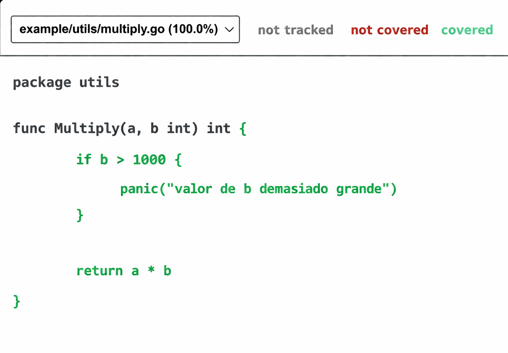

Esto abrirá un informe en el navegador donde podremos ver claramente qué partes del código están cubiertas y cuáles no.

Lo mejor es que todo esto viene incluido directamente en las herramientas estándar de Go.

# Genéricos

En esta sección, aprenderemos sobre los Genéricos, una función muy esperada que se incorporó en la versión 1.18 de Go.

## ¿Qué son los Genéricos?

Los genéricos significan tipos parametrizados. En pocas palabras, los genéricos permiten a los programadores escribir código donde el tipo puede especificarse más adelante, porque el tipo no es inmediatamente relevante.

Veamos un ejemplo para entenderlo mejor.

En nuestro ejemplo, tenemos funciones simples de suma para diferentes tipos como `int`, `float64`, y `string`. Dado que la sobrecarga de métodos no está permitida en Go, normalmente debemos crear nuevas funciones.

```go
package main

import "fmt"

func sumInt(a, b int) int {
	return a + b
}

func sumFloat(a, b float64) float64 {
	return a + b
}

func sumString(a, b string) string {
	return a + b
}

func main() {
	fmt.Println(sumInt(1, 2))
	fmt.Println(sumFloat(4.0, 2.0))
	fmt.Println(sumString("a", "b"))
}
```

Como podemos ver, aparte de los tipos, estas funciones son muy similares.

Veamos cómo podemos definir una función genérica.

```go
func fnName[T constraint]() {
	...
}
```

Aquí, `T` es nuestro **parámetro de tipo**, y `constraint` será la **interfaz** que permitirá cualquier tipo que implemente dicha interfaz.

Lo sé ... suena confuso. Así que empecemos a construir nuestra función genérica `sum`.

En este caso, usaremos `T` como parámetro de tipo, con una interfaz vacía `interface{}` como restricción.

```go
func sum[T interface{}](a, b T) T {
	fmt.Println(a, b)
}
```

Además, a partir de Go 1.18 podemos usar `any`, que es prácticamente equivalente a la interfaz vacía.

```go
func sum[T any](a, b T) T {
	fmt.Println(a, b)
}
```

Cuando usamos **parámetros de tipo**, también necesitamos pasar argumentos de tipo, lo cual puede hacer que nuestro código sea más verboso.

```go
sum[int](1, 2) // argumento de tipo explícito
sum[float64](4.0, 2.0)
sum[string]("a", "b")
```

Por suerte, Go 1.18 incorpora la inferencia de tipos, lo que nos permite escribir código que llama a funciones genéricas sin especificar explícitamente los tipos.

```go
sum(1, 2)
sum(4.0, 2.0)
sum("a", "b")
```

Ejecutemos esto para ver si funciona.

```bash
$ go run main.go
1 2
4 2
a b
```

Ahora, actualicemos la función `sum` para sumar nuestras variables.

```go
func sum[T any](a, b T) T {
	return a + b
}
```

```go
fmt.Println(sum(1, 2))
fmt.Println(sum(4.0, 2.0))
fmt.Println(sum("a", "b"))
```

Pero si ejecutamos esto ahora, obtendremos un error indicando que el operador `+` no está definido en la restricción.

```bash
$ go run main.go
./main.go:6:9: invalid operation: operator + not defined on a (variable of type T constrained by any)
```

Aunque la restricción del tipo `any` funciona en general, no admite operadores.

Por lo tanto, definamos nuestra propia restricción personalizada usando una interfaz. Nuestra interfaz debe definir un conjunto de tipos que contenga `int`, `float`, y `string`.

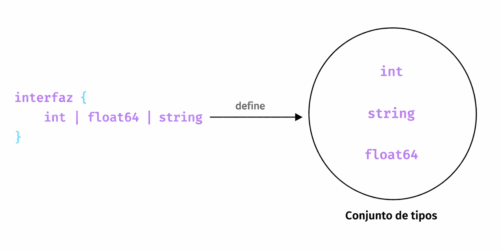

Así es como se ve nuestra interfaz `SumConstraint`:

```go
type SumConstraint interface {
	int | float64 | string
}

func sum[T SumConstraint](a, b T) T {
	return a + b
}

func main() {
	fmt.Println(sum(1, 2))
	fmt.Println(sum(4.0, 2.0))
	fmt.Println(sum("a", "b"))
}
```

Y esto debería funcionar como esperamos.

```bash
$ go run main.go
3
6
ab
```
También podemos usar el paquete `constraints`, que define un conjunto de restricciones útiles para usar con parámetros de tipo.

```go
type Signed interface {
	~int | ~int8 | ~int16 | ~int32 | ~int64
}

type Unsigned interface {
	~uint | ~uint8 | ~uint16 | ~uint32 | ~uint64 | ~uintptr
}

type Integer interface {
	Signed | Unsigned
}

type Float interface {
	~float32 | ~float64
}

type Complex interface {
	~complex64 | ~complex128
}

type Ordered interface {
	Integer | Float | ~string
}
```

Para ello, necesitaremos instalar el paquete `constraints`.

```bash
$ go get golang.org/x/exp/constraints
go: added golang.org/x/exp v0.0.0-20220414153411-bcd21879b8fd
```

```go
import (
	"fmt"

	"golang.org/x/exp/constraints"
)

func sum[T constraints.Ordered](a, b T) T {
	return a + b
}

func main() {
	fmt.Println(sum(1, 2))
	fmt.Println(sum(4.0, 2.0))
	fmt.Println(sum("a", "b"))
}
```

Aquí estamos usando la restricción `Ordered`.

```go
type Ordered interface {
	Integer | Float | ~string
}
```

El símbolo `~` es un nuevo token añadido a Go, y la expresión `~string` significa el conjunto de todos los tipos cuyo tipo subyacente es `string`.

Y, como podemos comprobar, sigue funcionando correctamente.

```bash
$ go run main.go
3
6
ab
```

Los genéricos son una característica increíble, ya que permiten escribir funciones abstractas que pueden reducir drásticamente la duplicación de código en muchos casos.

## Cuándo usar genéricos

Entonces, ¿cuándo deberíamos usar genéricos? Podemos tomar los siguientes casos de uso como ejemplo:

- Funciones que operan sobre arrays, slices, maps y channels.
- Estructuras de datos de propósito general, como pilas (_stacks_) o listas enlazadas (_linked lists_).
- Para reducir la duplicación de código.

Por último, aunque los genéricos son una excelente incorporación al lenguaje, deberían usarse con moderación.

Se recomienda empezar por lo simple y solo escribir código genérico cuando hayamos implementado código muy similar al menos dos o tres veces.

# Concurrencia  

Ahora aprenderemos sobre la concurrencia, que es una de las características más potentes de Go.

Así que empecemos preguntándonos: ¿qué es la _“concurrencia”_?

## ¿Qué es la concurrencia?

La concurrencia, por definición, es la capacidad de dividir un programa informático o algoritmo en partes individuales que pueden ejecutarse de forma independiente.

El resultado final de un programa concurrente es el mismo que el de un programa que se ha ejecutado de forma secuencial.

Mediante la concurrencia, podemos obtener los mismos resultados en menos tiempo, aumentando así el rendimiento y la eficiencia global de nuestros programas.

## Concurrencia vs Paralelismo


Muchas personas confunden concurrencia con paralelismo porque ambos conceptos implican, en cierto modo, ejecutar código al mismo tiempo, pero en realidad son dos conceptos completamente diferentes.

La concurrencia es la tarea de ejecutar y gestionar múltiples cálculos al mismo tiempo, mientras que el paralelismo es la tarea de ejecutar múltiples cálculos simultáneamente.

Una cita sencilla de Rob Pike lo resume bastante bien:

_"La concurrencia consiste en tratar con muchas cosas a la vez. El paralelismo consiste en hacer muchas cosas a la vez."_

Pero la concurrencia en Go es más que solo sintaxis. Para aprovechar realmente su potencia, primero debemos entender cómo Go aborda la ejecución concurrente del código. Go se basa en un modelo de concurrencia llamado CSP (Procesos Secuenciales Comunicantes).

## Procesos Secuenciales Comunicantes (CSP)

Los [Procesos Secuenciales Comunicantes](https://dl.acm.org/doi/10.1145/359576.359585) (CSP, por sus siglas en inglés) es un modelo propuesto por Tony Hoare en 1978 que describe las interacciones entre procesos concurrentes. Supuso un gran avance en la informática, especialmente en el ámbito de la concurrencia.

Lenguajes como Go y Erlang han estado fuertemente inspirados por el concepto de CSP. A pesar de que la concurrencia es compleja, CSP nos permite dar una mejor estructura a nuestro código concurrente y proporciona un modelo para pensar sobre la concurrencia de una forma que la hace un poco más sencilla. En este modelo, los procesos son independientes y se comunican compartiendo canales entre ellos.


_Aprenderemos cómo Golang lo implementa utilizando goroutines y canales más adelante en el curso._

## Conceptos básicos

Ahora, familiaricémonos con algunos conceptos básicos de concurrencia.

### Condición de carrera de datos (Data Race)

Una condición de carrera de datos ocurre cuando varios procesos acceden al mismo recurso de forma concurrente.

Por ejemplo, un proceso lee mientras otro escribe simultáneamente en el mismo recurso.

### Condiciones de carrera (Race Conditions)

Una condición de carrera ocurre cuando el tiempo o el orden de los eventos afecta a la corrección de un fragmento de código.

### Interbloqueos (Deadlocks)

Un interbloqueo ocurre cuando todos los procesos están bloqueados esperando unos por otros y el programa no puede continuar.

**Condiciones de Coffman**

Existen cuatro condiciones, conocidas como las condiciones de Coffman, que deben cumplirse simultáneamente para que ocurra un interbloqueo.

- Exclusión mutua

Un proceso concurrente posee al menos un recurso en un momento dado, lo que impide que sea compartido.

_En el diagrama inferior, existe una única instancia del Recurso 1 y está siendo utilizado únicamente por el Proceso 1._


- Retención y espera (Hold and wait)

Un proceso concurrente mantiene un recurso y está esperando otro recurso adicional.

_En el diagrama inferior, el Proceso 2 posee los Recursos 2 y 3 y está solicitando el Recurso 1, que está en manos del Proceso 1._


- No expropiación (No preemption)

Un recurso que está siendo utilizado por un proceso concurrente no puede ser retirado por el sistema. Solo puede ser liberado por el proceso que lo posee.

_En el diagrama inferior, el Proceso 2 no puede quitarle el Recurso 1 al Proceso 1. Este solo será liberado cuando el Proceso 1 lo libere voluntariamente tras completar su ejecución._


- Espera circular (Circular wait)

Un proceso espera un recurso que está siendo utilizado por otro proceso, que a su vez espera un recurso de un tercer proceso, y así sucesivamente, hasta que el último proceso espera un recurso que posee el primero, formando una cadena circular.

_En el diagrama inferior, el Proceso 1 tiene asignado el Recurso 2 y solicita el Recurso 1. De manera similar, el Proceso 2 tiene asignado el Recurso 1 y solicita el Recurso 2, formando un ciclo de espera circular._


### Bloqueos activos (Livelocks)

Los bloqueos activos son situaciones en las que los procesos están ejecutando operaciones concurrentes activamente, pero dichas operaciones no hacen avanzar el estado del programa.

### Inanición (Starvation)

La inanición ocurre cuando un proceso no recibe los recursos necesarios y, por tanto, no puede completar su ejecución.

La inanición puede ocurrir debido a interbloqueos o a algoritmos de planificación ineficientes. Para solucionarla, es necesario emplear mejores algoritmos de asignación de recursos que garanticen que cada proceso reciba su parte justa de recursos.

# Goroutines

Vamos ahora con las goroutines.

Pero antes de comenzar, quiero compartir un importante proverbio de Go:

_"No te comuniques compartiendo memoria, comparte memoria comunicándote."_ – Rob Pike

## ¿Qué es una goroutine?

Una _goroutine_ es un hilo de ejecución ligero gestionado por el runtime de Go, que nos permite escribir código asíncrono de forma similar a código síncrono.

Es importante saber que no son hilos reales del sistema operativo y que la función main también se ejecuta como una goroutine.

Un único hilo puede ejecutar miles de goroutines gracias al planificador del runtime de Go, que utiliza un modelo de planificación cooperativa. Esto implica que, si la goroutine actual se bloquea o finaliza, el planificador moverá otras goroutines a otro hilo del sistema operativo. De este modo, se logra una planificación eficiente en la que ninguna rutina queda bloqueada indefinidamente.

Podemos convertir cualquier función en una goroutine simplemente utilizando la palabra clave `go`.

```go
go fn(x, y, z)
```

Antes de escribir código, es importante hablar brevemente del modelo fork-join.

## Modelo Fork-Join

Go utiliza el modelo de concurrencia fork-join como base para las goroutines. Este modelo implica que un proceso hijo se separa de su proceso padre para ejecutarse de forma concurrente con él. Una vez que finaliza su ejecución, el proceso hijo se vuelve a unir al proceso padre. El punto en el que se reincorpora se denomina punto de unión (join point).


Ahora, escribamos algo de código y creemos nuestra propia goroutine.

```go
package main

import "fmt"

func speak(arg string) {
	fmt.Println(arg)
}

func main() {
	go speak("Hola Mundo")
}
```

Aquí, la llamada a la función `speak` está precedida por la palabra clave `go`. Esto permite que se ejecute como una goroutine independiente. ¡Y ya está, acabamos de crear nuestra primera goroutine! ¡Así de simple!

Vamos a ejecutarlo:

```bash
$ go run main.go
```

Curiosamente, parece que nuestro programa no se ejecutó completamente, ya que falta parte de la salida. Esto se debe a que la goroutine principal (`main`) terminó su ejecución sin esperar a la goroutine que creamos.

¿Qué ocurre si hacemos que el programa espere usando la función `time.Sleep`?

```go
func main() {
	...
	time.Sleep(1 * time.Second)
}
```

```bash
$ go run main.go
Hello World
```

Ahora sí, podemos ver la salida completa.

**Bien, esto funciona, pero no es lo ideal. ¿Cómo podemos mejorarlo?**

La parte más complicada de trabajar con goroutines es saber cuándo terminan. Es importante tener en cuenta que las goroutines se ejecutan en el mismo espacio de direcciones, por lo que el acceso a memoria compartida debe sincronizarse.

# Canales

Aprendamos sobre los canales.

## ¿Qué son los canales?

Un canal es, de forma sencilla, un medio de comunicación entre goroutines. Los datos entran por un extremo y salen por el otro en el mismo orden, hasta que el canal se cierra.


Como vimos anteriormente, los canales en Go se basan en el modelo de Procesos Secuenciales Comunicantes (CSP).

## Creación de un canal

Ahora que entendemos qué son los canales, veamos cómo declararlos.

```go
var ch chan T
```

Aquí, anteponemos la palabra clave `chan` (que significa canal) al tipo `T`, que representa el tipo de dato que queremos enviar y recibir.

Intentemos imprimir el valor de nuestro canal `ch` de tipo `string`.

```go
func main() {
	var ch chan string

	fmt.Println(ch)
}
```

```bash
$ go run main.go
<nil>
```

Como podemos ver, el valor cero de un canal es `nil`, y si intentamos enviar datos a través de él, el programa provocará un error (`panic`).

Por ello, al igual que con los slices, podemos inicializar un canal utilizando la función integrada `make`.

```go
func main() {
	ch := make(chan string)

	fmt.Println(ch)
}
```
Si ejecutamos esto, veremos que el canal ha sido inicializado correctamente.

```bash
$ go run main.go
0x1400010e060
```

## Envío y recepción de datos

Ahora que tenemos una comprensión básica de los canales, vamos a implementar nuestro ejemplo anterior utilizando canales para aprender cómo podemos usarlos para comunicarnos entre goroutines.

```go
package main

import "fmt"

func speak(arg string, ch chan string) {
	ch <- arg // Envío
}

func main() {
	ch := make(chan string)

	go speak("Hola Mundo", ch)

	data := <-ch // Recepción
	fmt.Println(data)
}
```
Observa cómo podemos enviar datos utilizando la sintaxis `canal <- dato` y recibir datos utilizando `dato := <-canal`.

```bash
$ go run main.go
Hola Mundo
```

Perfecto, nuestro programa se ejecutó tal como esperábamos.

## Canales con buffer

También existen los canales con buffer, que permiten almacenar un número limitado de valores sin necesidad de que exista un receptor inmediato para esos valores.


Esta _longitud del buffer_ o _capacidad_ se puede especificar mediante el segundo argumento de la función `make`.

```go
func main() {
	ch := make(chan string, 2)

	go speak("Hola Mundo", ch)
	go speak("Hola de nuevo", ch)

	data1 := <-ch
	fmt.Println(data1)

	data2 := <-ch
	fmt.Println(data2)
}
```
Como este canal tiene buffer, podemos enviar valores al canal sin necesidad de que exista un receptor concurrente en ese mismo momento. Esto significa que los `envíos` a un canal con buffer solo se bloquean cuando el buffer está lleno, y las `recepciones` se bloquean cuando el buffer está vacío.

Por defecto, un canal es no bufferizado (_unbuffered_) y tiene capacidad 0, por lo que omitimos el segundo argumento en la función `make`.

A continuación, veremos los canales direccionales.

## Canales direccionales

Cuando usamos canales como parámetros de funciones, podemos especificar si un canal está destinado únicamente a enviar o a recibir valores. Esto aumenta la seguridad de tipos de nuestro programa, ya que por defecto un canal puede tanto enviar como recibir valores.


En nuestro ejemplo, podemos actualizar el segundo argumento de la función speak para que solo pueda enviar un valor.

```go
func speak(arg string, ch chan<- string) {
	ch <- arg // Solo envío
}
```

Aquí, `chan<-` solo puede usarse para enviar valores y producirá un error si intentamos recibir valores.

## Cierre de canales

Al igual que ocurre con otros recursos, una vez que hemos terminado de utilizar un canal, es necesario cerrarlo. Esto puede hacerse mediante la función incorporada `close`.

En este caso, simplemente pasamos el canal como argumento a la función `close`.

```go
func main() {
	ch := make(chan string, 2)

	go speak("Hola Mundo", ch)
	go speak("Hola de nuevo", ch)

	data1 := <-ch
	fmt.Println(data1)

	data2 := <-ch
	fmt.Println(data2)

	close(ch)
}
```

Opcionalmente, los receptores pueden comprobar si un canal ha sido cerrado asignando un segundo parámetro a la expresión de recepción.

```go
func main() {
	ch := make(chan string, 2)

	go speak("Hola Mundo", ch)
	go speak("Hola de nuevo", ch)

	data1 := <-ch
	fmt.Println(data1)

	data2, ok := <-ch
	fmt.Println(data2, ok)

	close(ch)
}
```
Si `ok` es `false`, entonces no hay más valores que recibir y el canal está cerrado.

_De alguna manera, esto es similar a cómo comprobamos si una clave existe o no en un map_.

## Propiedades

Por último, vamos a comentar algunas propiedades de los canales:

- Un envío a un canal `nil` se bloquea indefinidamente.
```go
var c chan string
c <- "Hola Mundo!" // Panic: todas las goroutines están dormidas - deadlock
```

- Una recepción desde un canal `nil` se bloquea indefinidamente.
```go
var c chan string
fmt.Println(<-c) // Panic: todas las goroutines están dormidas - deadlock
```

- Un envío a un canal cerrado provoca un error (`panic`).
```go
var c = make(chan string, 1)
c <- "Hola Mundo!"
close(c)
c <- "Hola, Panic!" // Panic: envío sobre canal cerrado
```

- Una recepción desde un canal cerrado devuelve inmediatamente el valor cero.
```go
var c = make(chan int, 2)
c <- 5
c <- 4
close(c)
for i := 0; i < 4; i++ {
    fmt.Printf("%d ", <-c) // Salida: 5 4 0 0
}
```

- Iteración sobre canales con `range`.

También podemos usar `for` y `range` para iterar sobre los valores recibidos de un canal.

```go
package main

import "fmt"

func main() {
	ch := make(chan string, 2)

	ch <- "Hola"
	ch <- "Mundo"

	close(ch)

	for data := range ch {
		fmt.Println(data)
	}
}
```

# Select

En este tutorial aprenderemos sobre la sentencia `select` en Go.

La sentencia `select` bloquea la ejecución y espera múltiples operaciones sobre canales de forma simultánea.

Un `select` se bloquea hasta que uno de sus casos puede ejecutarse, y entonces ejecuta ese caso. Si varios están listos al mismo tiempo, selecciona uno de forma aleatoria.

```go
package main

import (
	"fmt"
	"time"
)

func main() {
	one := make(chan string)
	two := make(chan string)

	go func() {
		time.Sleep(time.Second * 2)
		one <- "Uno"
	}()

	go func() {
		time.Sleep(time.Second * 1)
		two <- "Dos"
	}()

	select {
	case result := <-one:
		fmt.Println("Recibido:", result)
	case result := <-two:
		fmt.Println("Recibido:", result)
	}

	close(one)
	close(two)
}
```

De forma similar a `switch`, `select` también tiene un caso `default` que se ejecuta si ningún otro caso está listo. Esto permite enviar o recibir sin bloquear.

```go
func main() {
	one := make(chan string)
	two := make(chan string)

	for x := 0; x < 10; x++ {
		go func() {
			time.Sleep(time.Second * 2)
			one <- "Uno"
		}()

		go func() {
			time.Sleep(time.Second * 1)
			two <- "Dos"
		}()
	}

	for x := 0; x < 10; x++ {
		select {
		case result := <-one:
			fmt.Println("Recibido:", result)
		case result := <-two:
			fmt.Println("Recibido:", result)
		default:
			fmt.Println("Default...")
			time.Sleep(200 * time.Millisecond)
		}
	}

	close(one)
	close(two)
}
```

También es importante saber que un `select {}` bloquea indefinidamente.

```go
func main() {
	...
	select {}

	close(one)
	close(two)
}
```

# Paquete Sync

Como vimos anteriormente, las goroutines se ejecutan en el mismo espacio de direcciones, por lo que el acceso a memoria compartida debe sincronizarse. El paquete [`sync`](https://go.dev/pkg/sync) proporciona primitivas útiles para ello.

## WaitGroup

Un `WaitGroup` permite esperar a que un conjunto de goroutines finalice su ejecución. La goroutine principal llama a `Add` para indicar el número de goroutines que debe esperar. Después, cada goroutine se ejecuta y llama a `Done` cuando termina. Mientras tanto, `Wait` se puede utilizar para bloquear la ejecución hasta que todas las goroutines hayan finalizado.

### Uso

Podemos utilizar `sync.WaitGroup` mediante los siguientes métodos:

- `Add(delta int)` recibe un valor entero que indica el número de goroutines que el `WaitGroup` debe esperar. Debe llamarse antes de lanzar las goroutines.
- `Done()` se llama dentro de cada goroutine para indicar que ha finalizado correctamente.
- `Wait()` bloquea el programa hasta que todas las goroutines indicadas con `Add()` hayan invocado `Done()`.

### Ejemplo

Vamos a ver un ejemplo.

```go
package main

import (
	"fmt"
	"sync"
)

func work() {
	fmt.Println("working...")
}

func main() {
	var wg sync.WaitGroup

	wg.Add(1)
	go func() {
		defer wg.Done()
		work()
	}()

	wg.Wait()
}
```

Si ejecutamos esto, podemos ver que el programa funciona como se espera.

```bash
$ go run main.go
working...
```

También podemos pasar el `WaitGroup` directamente a la función.

```go
func work(wg *sync.WaitGroup) {
	defer wg.Done()
	fmt.Println("working...")
}

func main() {
	var wg sync.WaitGroup

	wg.Add(1)

	go work(&wg)

	wg.Wait()
}
```
Es importante saber que un `WaitGroup` **no debe copiarse** después de su primer uso. Si se pasa explícitamente a funciones, debe hacerse mediante un _puntero_. Esto es así porque copiarlo puede afectar al contador interno y romper la lógica del programa.

Vamos ahora a aumentar el número de goroutines indicando con `Add` que queremos esperar a 4.


```go
func main() {
	var wg sync.WaitGroup

	wg.Add(4)

	go work(&wg)
	go work(&wg)
	go work(&wg)
	go work(&wg)

	wg.Wait()
}
```

Y, como era de esperar, todas las goroutines se ejecutan.

```bash
$ go run main.go
working...
working...
working...
working...
```
## Mutex

Un Mutex (exclusión mutua) es un mecanismo de bloqueo que impide que varios procesos o goroutines accedan simultáneamente a una sección crítica de datos, evitando así condiciones de carrera (race conditions).

### ¿Qué es una sección crítica?

Una sección crítica es una parte del código que no debe ejecutarse de forma concurrente por múltiples hilos o goroutines, ya que accede a recursos compartidos.

### Uso

Podemos utilizar `sync.Mutex` mediante los siguientes métodos:
- `Lock()` adquiere el bloqueo.
- `Unlock()` libera el bloqueo.
- `TryLock()` intenta adquirir el bloqueo e indica si lo ha conseguido.

### Ejemplo

Veamos un ejemplo. Vamos a crear una estructura `Counter` y añadir un método Update que actualice su valor interno.

```go
package main

import (
	"fmt"
	"sync"
)

type Counter struct {
	value int
}

func (c *Counter) Update(n int, wg *sync.WaitGroup) {
	defer wg.Done()
	fmt.Printf("Añadiendo %d to %d\n", n, c.value)
	c.value += n
}

func main() {
	var wg sync.WaitGroup

	c := Counter{}

	wg.Add(4)

	go c.Update(10, &wg)
	go c.Update(-5, &wg)
	go c.Update(25, &wg)
	go c.Update(19, &wg)

	wg.Wait()
	fmt.Printf("Resultado es %d", c.value)
}
```

Ejecutamos el programa:

```bash
$ go run main.go
Añadiendo -5 to 0
Añadiendo 10 to 0
Añadiendo 19 to 0
Añadiendo 25 to 0
Resultado es 49
```
Esto no parece correcto, ya que el valor parece ser siempre 0 durante las operaciones, aunque el resultado final sea correcto.

Esto ocurre porque varias goroutines están actualizando simultáneamente la variable `value`, lo que provoca una condición de carrera (race condition).

Este es un caso ideal para utilizar un Mutex. Vamos a utilizar `sync.Mutex` y proteger la sección crítica con `Lock()` y `Unlock()`.


```go
package main

import (
	"fmt"
	"sync"
)

type Counter struct {
	m     sync.Mutex
	value int
}

func (c *Counter) Update(n int, wg *sync.WaitGroup) {
	c.m.Lock()
	defer wg.Done()
	fmt.Printf("Añadiendo %d to %d\n", n, c.value)
	c.value += n
	c.m.Unlock()
}

func main() {
	var wg sync.WaitGroup

	c := Counter{}

	wg.Add(4)

	go c.Update(10, &wg)
	go c.Update(-5, &wg)
	go c.Update(25, &wg)
	go c.Update(19, &wg)

	wg.Wait()
	fmt.Printf("Resultado es %d", c.value)
}
```

```bash
$ go run main.go
Añadiendo -5 to 0
Añadiendo 19 to -5
Añadiendo 25 to 14
Añadiendo 10 to 39
Resultado es 49
```

Ahora el comportamiento es correcto y consistente, ya que hemos evitado accesos concurrentes a la sección crítica. 

_Nota: Al igual que WaitGroup, un Mutex **no debe copiarse** después de su primer uso._

## RWMutex

Un RWMutex es un mecanismo de exclusión mutua de tipo lector/escritor. El bloqueo puede ser mantenido por múltiples lectores simultáneamente o por un único escritor.

En otras palabras, los lectores no tienen que esperar entre sí, pero sí deben esperar si hay un escritor que posee el bloqueo.

Por tanto, `sync.RWMutex` es preferible cuando los datos se leen con mucha frecuencia y se escriben poco, ya que mejora el rendimiento respecto a `sync.Mutex`.

##€ Uso

De forma similar a `sync.Mutex`, podemos utilizar `sync.RWMutex` mediante los siguientes métodos:

- `Lock()` adquiere el bloqueo para escritura.
- `Unlock()` libera el bloqueo de escritura.
- `RLock()` adquiere el bloqueo de lectura.
- `RUnlock()`libera el bloqueo de lectura.

Nótese que `RWMutex` añade los métodos `RLock` y `RUnlock` respecto a Mutex.

### Ejemplo

Vamos a añadir un método `GetValue` que lea el valor del contador. También cambiaremos `sync.Mutex` por `sync.RWMutex`.

Ahora podemos usar los métodos `RLock` y `RUnlock` para que los lectores no tengan que esperar entre sí.

```go
package main

import (
	"fmt"
	"sync"
	"time"
)

type Counter struct {
	m     sync.RWMutex
	value int
}

func (c *Counter) Update(n int, wg *sync.WaitGroup) {
	defer wg.Done()

	c.m.Lock()
	fmt.Printf("Añadiendo %d to %d\n", n, c.value)
	c.value += n
	c.m.Unlock()
}

func (c *Counter) GetValue(wg *sync.WaitGroup) {
	defer wg.Done()

	c.m.RLock()
	defer c.m.RUnlock()
	fmt.Println("Get valor:", c.value)
	time.Sleep(400 * time.Millisecond)
}

func main() {
	var wg sync.WaitGroup

	c := Counter{}

	wg.Add(4)

	go c.Update(10, &wg)
	go c.GetValue(&wg)
	go c.GetValue(&wg)
	go c.GetValue(&wg)

	wg.Wait()
}
```

```bash
$ go run main.go
Get valor: 0
Añadiendo 10 to 0
Get valor: 10
Get valor: 10
```
En este ejemplo, `Update` usa `Lock` porque modifica el valor y necesita acceso exclusivo. En cambio, `GetValue` usa `RLock` porque solo lee el valor, por lo que varias lecturas pueden ejecutarse al mismo tiempo.

_Nota: Tanto sync.Mutex como `sync.RWMutex` implementan la interfaz `sync.Locker`._

```go
type Locker interface {
    Lock()
    Unlock()
}
```

Esto significa que cualquier tipo que implemente los métodos `Lock()` y `Unlock()` puede utilizarse de forma intercambiable cuando se espera un `Locker`.

## Cond

La variable de condición `sync.Cond` puede utilizarse para coordinar goroutines que desean compartir recursos. Cuando el estado de los recursos compartidos cambia, permite notificar a las goroutines que están bloqueadas esperando sobre un mutex.

Cada `Cond` tiene asociado un bloqueo (normalmente un `*Mutex` o un `*RWMutex`), que debe mantenerse cuando se modifica la condición y cuando se llama al método Wait.

### ¿Por qué lo necesitamos?

Un escenario típico es cuando un proceso está recibiendo datos y otros procesos deben esperar a que esos datos estén disponibles antes de poder leerlos correctamente.

Si utilizamos únicamente un [canal](https://karanpratapsingh.com/courses/go/channels) o un mutex, solo un proceso puede esperar y leer los datos. No existe un mecanismo directo para notificar a múltiples procesos que los datos ya están disponibles.

Por ello, `sync.Cond` permite coordinar el acceso a recursos compartidos y notificar a varias goroutines.

### Uso

`sync.Cond` proporciona los siguientes métodos:

- `NewCond(l Locker)` devuelve una nueva variable de condición asociada a un `Locker`.
- `Broadcast()` despierta a todas las goroutines que están esperando en la condición.
- `Signal()` despierta a una goroutine que esté esperando (si hay alguna).
- `Wait()` libera el bloqueo asociado de forma atómica y bloquea la goroutine hasta que sea despertada.

### Ejemplo

A continuación se muestra un ejemplo que demuestra la interacción entre distintas goroutines utilizando `Cond`.

```go
package main

import (
	"fmt"
	"sync"
	"time"
)

var done = false

func read(name string, c *sync.Cond) {
	c.L.Lock()
	for !done {
		c.Wait()
	}
	fmt.Println(name, "empezando leyendo")
	c.L.Unlock()
}

func write(name string, c *sync.Cond) {
	fmt.Println(name, "empezando escribiendo")
	time.Sleep(time.Second)

	c.L.Lock()
	done = true
	c.L.Unlock()

	fmt.Println(name, "despierta a todos")
	c.Broadcast()
}

func main() {
	var m sync.Mutex
	cond := sync.NewCond(&m)

	go read("Lector 1", cond)
	go read("Lector 2", cond)
	go read("Lector 3", cond)
	write("Escritor", cond)

	time.Sleep(4 * time.Second)
}
```

```bash
$ go run main.go
Escritor starts writing
Escritor wakes all
Lector 2 starts reading
Lector 3 starts reading
Lector 1 starts reading
```

Como se puede observar, los lectores quedan suspendidos mediante el método `Wait` hasta que el escritor utiliza el método `Broadcast` para despertarlos.


## Once

Once garantiza que una determinada acción se ejecute una única vez, incluso cuando varias goroutines intentan ejecutarla simultáneamente.

### Uso

A diferencia de otras primitivas, `sync.Once` solo dispone de un único método:

- `Do(f func())` ejecuta la función `f`**una única vez**. Si `Do` se llama varias veces, solo la primera llamada ejecutará la función `f`.
### Ejemplo

Esto es bastante directo. Veamos un ejemplo:

```go
package main

import (
	"fmt"
	"sync"
)

func main() {
	var count int

	increment := func() {
		count++
	}

	var once sync.Once

	var increments sync.WaitGroup
	increments.Add(100)

	for i := 0; i < 100; i++ {
		go func() {
			defer increments.Done()
			once.Do(increment)
		}()
	}

	increments.Wait()
	fmt.Printf("Count es %d\n", count)
}
```

```bash
$ go run main.go
Count es 1
```

Como se puede observar, aunque se han lanzado 100 goroutines, el contador solo se incrementa una vez.

## Pool

Pool es un contenedor escalable de objetos temporales y es seguro para concurrencia. Cualquier valor almacenado en el pool puede ser eliminado en cualquier momento sin notificación. Además, bajo alta carga, el pool puede expandirse dinámicamente y, cuando no se utiliza o la concurrencia disminuye, puede reducirse.

_La idea clave es la reutilización de objetos para evitar creaciones y destrucciones repetidas, lo que afecta al rendimiento._

### ¿Por qué lo necesitamos?

El propósito de Pool es almacenar en caché objetos ya asignados pero no utilizados para su reutilización posterior, reduciendo la presión sobre el recolector de basura (_garbage collector_). Es decir, facilita la creación de listas libres (_free lists_) eficientes y seguras para concurrencia. Sin embargo, no es adecuado para todos los casos.

El uso adecuado de un Pool es gestionar un conjunto de objetos temporales compartidos de forma transparente entre múltiples clientes concurrentes de un paquete. Pool permite distribuir el coste de asignación entre muchos clientes.

_Es importante destacar que Pool también tiene un coste en rendimiento. Usar `sync.Pool` es más lento que una inicialización simple. Además, un Pool no debe copiarse después de su primer uso._

### Uso

`sync.Pool` proporciona los siguientes métodos:

- `Get()` selecciona un elemento arbitrario del pool, lo elimina y lo devuelve al llamador.
- `Put(x any)` añade un elemento al pool.

### Ejemplo

Veamos un ejemplo.

Primero, creamos un `sync.Pool`, donde opcionalmente podemos definir una función New que genere un valor cuando se llame a `Get`. Si no se define, devolverá `nil`.


```go
package main

import (
	"fmt"
	"sync"
)

type Person struct {
	Name string
}

var pool = sync.Pool{
	New: func() any {
		fmt.Println("Creando nueva persona...")
		return &Person{}
	},
}

func main() {
	person := pool.Get().(*Person)
	fmt.Println("Obtener objeto de sync.Pool por primera vez:", person)

	fmt.Println("Devolver el objeto al pool")
	pool.Put(person)

	person.Name = "Gopher"
	fmt.Println("Establecer la propiedad nombre del objeto:", person.Name)

	fmt.Println("Obtener el objeto del pool de nuevo (está actualizado):", pool.Get().(*Person))
	fmt.Println("Ya no hay ningún objeto en el pool ahora se creará uno nuevo:", pool.Get().(*Person))
}
```

Al ejecutarlo, obtenemos una salida interesante:

```bash
$ go run main.go
Creando nueva persona...
Obtener objeto de sync.Pool por primera vez: &{}
Devolver el objeto al pool
Establecer la propiedad nombre del objeto: Gopher
Obtener el objeto del pool de nuevo (está actualizado): &{Gopher}
Creando nueva persona...
Ya no hay ningún objeto en el pool ahora se creará uno nuevo: &{}
```

_Observa cómo hemos utilizado una aserción de tipo ([type assertion](https://karanpratapsingh.com/courses/go/interfaces#type-assertion)) al llamar a `Get`._

Se puede ver que `sync.Pool` es estrictamente un pool de objetos temporales, adecuado para almacenar objetos que serán compartidos y reutilizados entre goroutines.

## Map

Map es similar al tipo estándar `map[any]any`, pero es seguro para su uso concurrente por múltiples goroutines sin necesidad de mecanismos adicionales de bloqueo o coordinación. Las operaciones de lectura, escritura y borrado tienen un coste constante.

### ¿Por qué lo necesitamos?

El tipo Map es _especializado_. En la mayoría de los casos, se recomienda utilizar un map estándar de Go junto con mecanismos de sincronización (como Mutex o RWMutex), ya que ofrece mayor seguridad de tipos y facilita el mantenimiento de invariantes.

El tipo Map está optimizado para dos casos de uso comunes:

- Cuando el valor asociado a una clave se escribe una única vez pero se lee muchas veces (por ejemplo, en cachés que solo crecen).
- Cuando múltiples goroutines leen, escriben y sobrescriben valores sobre conjuntos de claves distintos. En estos casos, `sync.Map` puede reducir significativamente la contención frente a un map tradicional protegido con `Mutex` o `RWMutex`.

_El valor cero de un Map está vacío y listo para usar. Un Map no debe copiarse después de su primer uso._

### Uso

`sync.Map` proporciona los siguientes métodos:

- `Delete()` elimina el valor asociado a una clave.
- `Load(key any)` devuelve el valor asociado a una clave, o nil si no existe.
- `LoadAndDelete(key any)` elimina el valor asociado a una clave y devuelve el valor anterior si existía. Además indica si la clave estaba presente.
- `LoadOrStore(key, value any)` devuelve el valor existente si la clave ya estaba presente. En caso contrario, almacena y devuelve el nuevo valor. Indica si el valor fue cargado (true) o almacenado (false).
- `Store(key, value any)` asigna un valor a una clave.
- `Range(f func(key, value any) bool)` recorre el mapa llamando a `f` para cada par clave-valor. Si `f` devuelve false, se detiene la iteración.

_Nota: Range no garantiza una vista consistente del contenido del mapa._

### Ejemplo

Veamos un ejemplo. En este caso lanzamos varias goroutines que insertan y leen valores del mapa de forma concurrente.

```go
package main

import (
	"fmt"
	"sync"
)

func main() {
	var wg sync.WaitGroup
	var m sync.Map

	wg.Add(10)
	for i := 0; i <= 4; i++ {
		go func(k int) {
			v := fmt.Sprintf("valor %v", k)

			fmt.Println("Escribiendo:", v)
			m.Store(k, v)
			wg.Done()
		}(i)
	}

	for i := 0; i <= 4; i++ {
		go func(k int) {
			v, _ := m.Load(k)
			fmt.Println("Leyendo: ", v)
			wg.Done()
		}(i)
	}

	wg.Wait()
}
```

Como es de esperar, las operaciones de escritura y lectura son seguras en ejecución concurrente.

```bash
$ go run main.go
Leyendo: <nil>
Escribiendo: value 0
Escribiendo: value 1
Escribiendo: value 2
Escribiendo: value 3
Escribiendo: value 4
Leyendo: value 0
Leyendo: value 1
Leyendo: value 2
Leyendo: value 3
```

## Atomic

El paquete atomic proporciona primitivas de memoria de bajo nivel para realizar operaciones atómicas sobre enteros y punteros. Estas operaciones son útiles para implementar algoritmos de sincronización.

### Usage

El paquete `atomic` ofrece [varias funciones](https://pkg.go.dev/sync/atomic#pkg-functions) que realizan las siguientes 5 operaciones sobre tipos `int`, `uint`, y `uintptr`:

- Add (sumar)
- Load (leer)
- Store (escribir)
- Swap (intercambiar)
- Compare and Swap (comparar e intercambiar)

### Ejemplo

No es posible cubrir todas las funciones aquí, así que veremos una de las más utilizadas, `AddInt32`, para entender su funcionamiento.

```go
package main

import (
  "fmt"
	"sync"
	"sync/atomic"
)

func add(w *sync.WaitGroup, num *int32) {
	defer w.Done()
	atomic.AddInt32(num, 1)
}

func main() {
	var n int32 = 0
	var wg sync.WaitGroup

	wg.Add(1000)
	for i := 0; i < 1000; i = i + 1 {
		go add(&wg, &n)
	}

	wg.Wait()

	fmt.Println("Resultado:", n)
}
```
En este ejemplo, `atomic.AddInt32` garantiza que el valor final de `n` será 1000, ya que la ejecución de las operaciones atómicas no puede ser interrumpida.

```bash
$ go run main.go
Resultado: 1000
```

Las operaciones atómicas permiten modificar variables compartidas sin necesidad de usar `Mutex`, evitando condiciones de carrera en escenarios simples.

# Patrones avanzados de concurrencia

En este apartado se presentan algunos patrones avanzados de concurrencia en Go. En la práctica, estos patrones suelen utilizarse de forma combinada en aplicaciones reales.

## Generator


El patrón generator (generador) se utiliza para producir una secuencia de valores que posteriormente se consumen para generar una salida.

En este ejemplo, tenemos una función `generator` que devuelve un canal desde el cual podemos leer valores.

Este patrón se basa en el hecho de que las operaciones de _envío_ y _recepción_ en canales son bloqueantes hasta que tanto el emisor como el receptor están listos. Esta propiedad permite generar valores bajo demanda.

```go
package main

import "fmt"

func main() {
	ch := generator()

	for i := 0; i < 5; i++ {
		value := <-ch
		fmt.Println("Valor:", value)
	}
}

func generator() <-chan int {
	ch := make(chan int)

	go func() {
		for i := 0; ; i++ {
			ch <- i
		}
	}()

	return ch
}
```

Si ejecutamos este programa, veremos que los valores se generan y consumen según se necesitan:

```bash
$ go run main.go
Valor: 0
Valor: 1
Valor: 2
Valor: 3
Valor: 4
```
El generador produce valores de forma continua, pero solo se consumen cuando el programa los solicita.

_Este comportamiento es similar al uso de `yield` en lenguajes como JavaScript o Python._

## Fan-in


El patrón fan-in combina múltiples entradas en un único canal de salida. Es decir, permite multiplexar varias fuentes de datos en un solo flujo.

En este ejemplo, se crean dos entradas `i1` e `i2` mediante la función `generateWork`. A continuación, se utiliza la [función variádica](https://karanpratapsingh.com/courses/go/functions#variadic-functions) `fanIn` para combinar los valores de ambas entradas en un único canal de salida, desde el cual se consumen los valores.

_Nota: el orden de los valores en la salida no está garantizado._

```go
package main

import (
	"fmt"
	"sync"
)

func main() {
	i1 := generateWork([]int{0, 2, 6, 8})
	i2 := generateWork([]int{1, 3, 5, 7})

	out := fanIn(i1, i2)

	for value := range out {
		fmt.Println("Valor:", value)
	}
}

func fanIn(inputs ...<-chan int) <-chan int {
	var wg sync.WaitGroup
	out := make(chan int)

	wg.Add(len(inputs))

	for _, in := range inputs {
		go func(ch <-chan int) {
			for {
				value, ok := <-ch

				if !ok {
					wg.Done()
					break
				}

				out <- value
			}
		}(in)
	}

	go func() {
		wg.Wait()
		close(out)
	}()

	return out
}

func generateWork(work []int) <-chan int {
	ch := make(chan int)

	go func() {
		defer close(ch)

		for _, w := range work {
			ch <- w
		}
	}()

	return ch
}
```

```bash
$ go run main.go
Valor: 0
Valor: 1
Valor: 2
Valor: 6
Valor: 8
Valor: 3
Valor: 5
Valor: 7
```
El patrón fan-in permite combinar múltiples fuentes de eventos en un único flujo, algo muy útil en sistemas reactivos donde varios sensores generan información simultáneamente.

## Fan-out


El patrón fan-out permite dividir un único canal de entrada en múltiples canales de salida. Es un patrón útil para distribuir elementos de trabajo entre varios actores o trabajadores uniformes.

En este ejemplo, dividimos el canal de entrada en 4 canales de salida diferentes. Para un número dinámico de salidas, podríamos combinar las salidas en un canal compartido de agregación y utilizar `select`.


_Nota: el patrón fan-out es diferente del patrón pub/sub._

```go
package main

import "fmt"

func main() {
	work := []int{1, 2, 3, 4, 5, 6, 7, 8}
	in := generateWork(work)

	out1 := fanOut(in)
	out2 := fanOut(in)
	out3 := fanOut(in)
	out4 := fanOut(in)

	for range work {
		select {
		case value := <-out1:
			fmt.Println("La salida 1 recibió:", value)
		case value := <-out2:
			fmt.Println("La salida 2 recibió:", value)
		case value := <-out3:
			fmt.Println("La salida 3 recibió:", value)
		case value := <-out4:
			fmt.Println("La salida 4 recibió:", value)
		}
	}
}

func fanOut(in <-chan int) <-chan int {
	out := make(chan int)

	go func() {
		defer close(out)

		for data := range in {
			out <- data
		}
	}()

	return out
}

func generateWork(work []int) <-chan int {
	ch := make(chan int)

	go func() {
		defer close(ch)

		for _, w := range work {
			ch <- w
		}
	}()

	return ch
}
```

Como se puede observar, el trabajo se reparte entre varias goroutines.

```bash
$ go run main.go
La salida 1 recibió: 1
La salida 2 recibió: 3
La salida 4 recibió: 4
La salida 1 recibió: 5
La salida 3 recibió: 2
La salida 3 recibió: 6
La salida 3 recibió: 7
La salida 1 recibió: 8
```

El patrón fan-out permite repartir trabajo entre varios consumidores concurrentes, de modo que cada elemento del canal de entrada sea procesado por uno de ellos.

## Pipeline


El patrón pipeline consiste en una serie de etapas conectadas mediante canales, donde cada etapa está formada por una o varias goroutines que ejecutan la misma función.

En cada etapa, las goroutines:

- reciben valores desde la etapa anterior (_upstream_) mediante canales de entrada (_inbound channels_),
- realizan alguna operación sobre esos datos,
- envían los nuevos valores a la siguiente etapa (_downstream_) mediante canales de salida (_outbound channels_).

Cada etapa puede tener cualquier número de canales de entrada y de salida, excepto la primera y la última etapa, que tienen únicamente canales de salida o de entrada, respectivamente.

La primera etapa suele llamarse _fuente o productor_, y la última etapa suele llamarse _sumidero o consumidor_.

El uso de pipelines permite separar responsabilidades:

- cada etapa realiza una tarea concreta,
- las etapas pueden modificarse de forma independiente,
- se pueden combinar distintas etapas sin cambiar su implementación.

En este ejemplo se definen tres etapas: `filter`, `square`, y `half`.

```go
package main

import (
	"fmt"
	"math"
)

func main() {
	in := generateWork([]int{0, 1, 2, 3, 4, 5, 6, 7, 8})

	out := filter(in) // Filtra números pares
	out = square(out) // Eleva al cuadrado
	out = half(out)   // Divide entre dos

	for value := range out {
		fmt.Println(value)
	}
}

func filter(in <-chan int) <-chan int {
	out := make(chan int)

	go func() {
		defer close(out)

		for i := range in {
			if i%2 == 0 {
				out <- i
			}
		}
	}()

	return out
}

func square(in <-chan int) <-chan int {
	out := make(chan int)

	go func() {
		defer close(out)

		for i := range in {
			value := math.Pow(float64(i), 2)
			out <- int(value)
		}
	}()

	return out
}

func half(in <-chan int) <-chan int {
	out := make(chan int)

	go func() {
		defer close(out)

		for i := range in {
			value := i / 2
			out <- value
		}
	}()

	return out
}

func generateWork(work []int) <-chan int {
	ch := make(chan int)

	go func() {
		defer close(ch)

		for _, w := range work {
			ch <- w
		}
	}()

	return ch
}
```

Parece que la entrada se ha procesado correctamente mediante el pipeline de forma concurrente.

```bash
$ go run main.go
0
2
8
18
32
```

La transformación aplicada es:
```bash
0  -> 0²  -> 0/2  = 0
2  -> 4   -> 4/2  = 2
4  -> 16  -> 16/2 = 8
6  -> 36  -> 36/2 = 18
8  -> 64  -> 64/2 = 32
```

## Worker Pool


El patrón worker pool es un patrón muy potente que permite distribuir el trabajo entre múltiples trabajadores (goroutines) de forma concurrente.

En este ejemplo, tenemos:
- un canal `jobs`, donde se envían las tareas,
- un canal `results`, donde los trabajadores envían los resultados una vez completado el trabajo.

A continuación, se lanzan los trabajadores de forma concurrente y simplemente se recogen los resultados desde el canal `results`.

After that, we can launch our workers concurrently and simply receive the results from the `results` channel.

_Idealmente, `totalWorkers` debería establecerse usando `runtime.NumCPU()`, que devuelve el número de CPUs lógicas disponibles para el proceso._

```go
package main

import (
	"fmt"
	"sync"
)

const totalJobs = 4
const totalWorkers = 2

func main() {
	jobs := make(chan int, totalJobs)
	results := make(chan int, totalJobs)

	for w := 1; w <= totalWorkers; w++ {
		go worker(w, jobs, results)
	}

	// Enviar trabajos
	for j := 1; j <= totalJobs; j++ {
		jobs <- j
	}

	close(jobs)

	// Recibir resultados
	for a := 1; a <= totalJobs; a++ {
		<-results
	}

	close(results)
}

func worker(id int, jobs <-chan int, results chan<- int) {
	var wg sync.WaitGroup

	for j := range jobs {
		wg.Add(1)

		go func(job int) {
			defer wg.Done()

			fmt.Printf("Worker %d comenzó la tarea %d\n", id, job)

			// Realizar el trabajo y enviar resultado
			result := job * 2
			results <- result

			fmt.Printf("Worker %d terminó la tarea %d\n", id, job)
		}(j)
	}

	wg.Wait()
}
```

Tal y como se esperaba, los jobs se distribuyen en los workers.

```bash
$ go run main.go
Worker 2 comenzó la tarea 4
Worker 2 comenzó la tarea 1
Worker 1 comenzó la tarea 3
Worker 2 comenzó la tarea 2
Worker 2 terminó la tarea 1
Worker 1 terminó la tarea 3
Worker 2 terminó la tarea 2
Worker 2 terminó la tarea 4
```
El patrón worker pool permite repartir un conjunto de tareas entre varios trabajadores, mejorando el rendimiento y aprovechando la concurrencia del sistema.

Es especialmente útil cuando:

- hay muchas tareas independientes,
- cada tarea puede procesarse de forma paralela,
- se quiere limitar el número de goroutines activas (controlando `totalWorkers`).

## Patrón de cola


El patrón `queuing` permite procesar un número `n` limitado de elementos al mismo tiempo.

En este ejemplo, se utiliza un canal con buffer para simular el comportamiento de una cola. Enviamos una [estructura vacía struct{}{}](https://karanpratapsingh.com/courses/go/structs#properties) al canal nuestro `queue` y esperamos a que otro proceso libere espacio para poder continuar.

Esto funciona porque:
- los envíos (_sends_) a un canal con buffer solo bloquean cuando el buffer está lleno,
- las recepciones (_receives_) bloquean cuando el buffer está vacío.

En este caso, tenemos 10 elementos de trabajo y un límite de 2. Esto significa que solo se pueden procesar 2 elementos al mismo tiempo.

Here, we have total work of 10 items and we have a limit of 2. This means we can process 2 items at a time.

_Observa que el canal `queue` es de tipo `struct{}` porque una estructura vacía ocupa cero bytes de almacenamiento._

```go
package main

import (
	"fmt"
	"sync"
	"time"
)

const limit = 2
const work = 10

func main() {
	var wg sync.WaitGroup

	fmt.Println("Límite de la queue:", limit)
	queue := make(chan struct{}, limit)

	wg.Add(work)

	for w := 1; w <= work; w++ {
		process(w, queue, &wg)
	}

	wg.Wait()

	close(queue)
	fmt.Println("Tarea completada")
}

func process(work int, queue chan struct{}, wg *sync.WaitGroup) {
	queue <- struct{}{}

	go func() {
		defer wg.Done()

		time.Sleep(1 * time.Second)
		fmt.Println("Procesado:", work)

		<-queue
	}()
}
```

Si ejecutamos el programa, veremos que se produce una pequeña pausa cada vez que se procesan 2 elementos, porque ese es el límite de la cola.

```bash
$ go run main.go
Límite de la queue: 2
Procesado: 1
Procesado: 2
Procesado: 4
Procesado: 3
Procesado: 5
Procesado: 6
Procesado: 8
Procesado: 7
Procesado: 9
Procesado: 10
Tarea completada
```
La idea clave es que el canal `queue` no transporta datos relevantes, sino que actúa como un semáforo de concurrencia: limita cuántas goroutines pueden estar trabajando simultáneamente.

## Patrones adicionales

Algunos patrones adicionales que puede ser útil conocer son:

- canal _tee_,
- canal _bridge_,
- canal con _ring buffer_,
- paralelismo acotado.

# Contexto

En programas concurrentes, a menudo es necesario interrumpir operaciones debido a:

- tiempos de espera,
- cancelaciones,
- fallos en otra parte del sistema.

El paquete `context` facilita pasar:

- valores asociados a una petición,
- señales de cancelación,
- límites temporales,
- y plazos de ejecución,

a través de distintas APIs y hacia todas las goroutines implicadas en el procesamiento de una solicitud.

## Tipos

Veamos algunos tipos principales del paquete `context`.

### Context

`Context` es un tipo `interface` definido de la siguiente forma:

```go
type Context interface {
	Deadline() (deadline time.Time, ok bool)
	Done() <-chan struct{}
	Err() error
	Value(key any) any
}
```

El tipo `Context` tiene los siguientes métodos:

- `Done() <- chan struct{}` devuelve un canal que se cierra cuando el contexto se cancela o expira. Done puede devolver `nil` si el contexto nunca puede cancelarse.
- `Deadline() (deadline time.Time, ok bool)` devuelve el instante en el que el contexto será cancelado o expirará. `ok` será `false` si no hay ningún plazo establecido.
- `Err() error` devuelve un error que explica por qué se cerró el canal Done. Si Done todavía no se ha cerrado, devuelve `nil`.
- `Value(key any) any` devuelve el valor asociado a una clave, o `nil` si no existe ningún valor asociado.

### CancelFunc

Un `CancelFunc` indica a una operación que debe abandonar su ejecución, pero no espera a que esta finalice.

Si se invoca desde múltiples goroutines simultáneamente, solo la primera llamada tiene efecto; las siguientes no hacen nada.

```go
type CancelFunc func()
```

## Uso

A continuación se describen algunas funciones proporcionadas por el paquete `context`.

### Background

Background devuelve un `Context` vacío y no nulo. 

Este contexto:
- nunca se cancela,
- no contiene valores,
- no tiene límite de tiempo.

_Se utiliza normalmente en la función principal, en la inicialización y en pruebas, así como contexto raíz para solicitudes entrantes._

```go
func Background() Context
```

### TODO

De forma similar a la función `Background`, la función `TODO` también devuelve un `Context` vacío y no nulo.

Sin embargo, debe utilizarse únicamente cuando:

- no se sabe qué contexto utilizar, o
- la función todavía no ha sido adaptada para recibir un contexto.

Esto indica que se planea añadir el uso de `context` en el futuro.

```go
func TODO() Context
```

### WithValue

Esta función recibe un contexto y devuelve un nuevo contexto derivado en el que el valor `val` queda asociado a la clave `key`, propagándose a través del árbol de contextos.

Esto significa que cualquier contexto derivado de este heredará dicho valor.

_No se recomienda usar el contexto para pasar parámetros críticos. En su lugar, estos deberían aparecer explícitamente en la firma de la función._

```go
func WithValue(parent Context, key, val any) Context
```

**Ejemplo**

Veamos un ejemplo sencillo para entender cómo añadir un par clave-valor a un contexto:

```go
package main

import (
	"context"
	"fmt"
)

func main() {
	processID := "abc-xyz"

	ctx := context.Background()
	ctx = context.WithValue(ctx, "processID", processID)

	ProcessRequest(ctx)
}

func ProcessRequest(ctx context.Context) {
	value := ctx.Value("processID")
	fmt.Printf("Procesando ID: %v", value)
}
```
La ejecución sería:

```bash
$ go run main.go
Procesando ID: abc-xyz
```
El contexto permite transportar información asociada a una petición (como identificadores, trazas, etc.) entre distintas funciones y goroutines sin necesidad de modificar todas las firmas de funciones.

### WithCancel

Esta función crea un nuevo contexto a partir de un contexto padre y devuelve tanto el contexto derivado como una función de cancelación.

El contexto padre puede ser `context.Background` o un contexto recibido como parámetro en una función.

Cancelar este contexto libera los recursos asociados, por lo que se recomienda llamar a `cancel` tan pronto como finalicen las operaciones que utilizan dicho contexto.

_No es recomendable propagar la función `cancel`, ya que puede provocar comportamientos inesperados._

```go
func WithCancel(parent Context) (ctx Context, cancel CancelFunc)
```

### WithDeadline

Esta función devuelve un contexto derivado que se cancela automáticamente cuando se alcanza un instante de tiempo determinado (deadline) o cuando se invoca la función de cancelación.

Por ejemplo, podemos crear un contexto que se cancele automáticamente en un momento futuro y pasarlo a funciones hijas. Cuando el contexto se cancela por haber alcanzado el límite de tiempo, todas las funciones que lo utilizan son notificadas para detener su ejecución.

```go
func WithDeadline(parent Context, d time.Time) (Context, CancelFunc)
```

### WithTimeout

Esta función es un caso particular de `WithDeadline` en el que el límite se expresa como una duración (timeout).

```go
func WithTimeout(parent Context, timeout time.Duration) (Context, CancelFunc) {
	return WithDeadline(parent, time.Now().Add(timeout))
}
```

Estos mecanismos permiten construir sistemas concurrentes que pueden cancelarse, limitarse en el tiempo y liberar recursos correctamente, algo fundamental en sistemas reactivos y distribuidos.

## Ejemplo

Veamos un ejemplo para afianzar el uso de context.

En el siguiente código, tenemos un servidor HTTP sencillo que gestiona una petición:

```go
package main

import (
	"fmt"
	"net/http"
	"time"
)

func handleRequest(w http.ResponseWriter, req *http.Request) {
	fmt.Println("Handler arrancado")
	context := req.Context()

	select {
	// Simula trabajo del servidor durante 5 segundos
	case <-time.After(5 * time.Second):
		fmt.Fprintf(w, "Respuesta del servidor")

	// Maneja la cancelación de la petición
	case <-context.Done():
		err := context.Err()
		fmt.Println("Error:", err)
	}

	fmt.Println("Handler completado")
}

func main() {
	http.HandleFunc("/request", handleRequest)

	fmt.Println("Servidor funcionando...")
	http.ListenAndServe(":4000", nil)
}
```

Abrimos dos terminales. En el primero ejecutamos el programa:

```bash
$ go run main.go
Servidor funcionando...
Handler arrancado
Handler completado
```

En el segundo terminal realizamos una petición al servidor. Si esperamos 5 segundos, obtenemos una respuesta:

```bash
$ curl localhost:4000/request
Respuesta del servidor
```

Ahora veamos qué ocurre si cancelamos la petición antes de que termine.

_Nota: podemos usar `ctrl + c` para cancelar la petición._

```bash
$ curl localhost:4000/request
^C
```

En este caso, el servidor detecta la cancelación gracias al contexto de la petición:

```bash
$ go run main.go
Server funcionando...
Handler arrancado
Error: context canceled
Handler completado
```

El uso de context permite:

- detectar cancelaciones de forma automática,
- detener trabajo innecesario,
- liberar recursos correctamente,
- gestionar tiempos de espera y límites de ejecución.

Esto resulta especialmente útil en sistemas concurrentes y reactivos, donde las operaciones pueden dejar de ser necesarias antes de completarse.

# ¿Y ahora?

¡Enhorabuena! Has finalizado el curso.

Ahora que conoces los fundamentos de Go, puedes seguir profundizando con los siguientes recursos:

- [Construir una API REST con Go para principiantes](https://www.youtube.com/watch?v=bFYZrEuEDLE)
- [Conexión a PostgreSQL usando GORM](https://www.youtube.com/watch?v=Yk5ZjKq4qDQ)
- [Web scraping con Go](https://www.youtube.com/watch?v=sU_BwzOxl54)
- [Dockerizar una aplicación en Go](https://www.youtube.com/watch?v=zUc2LihXjlw)
- [Hoja de ruta de DevOps](https://www.youtube.com/watch?v=np_seazJL3Q)

A partir de aquí, el siguiente paso natural es aplicar estos conocimientos en proyectos reales que integren concurrencia, acceso a datos y despliegue.


# Referencias

Aquí están los recursos que se consultaron al crear este curso.

- [The Go Programming Language](https://www.gopl.io)
- [Official Go documentation](https://go.dev/doc)
- [Official Go blog](https://go.dev/blog)
- [A Tour of Go](https://go.dev/tour)
- [Learn Go with Tests](https://quii.gitbook.io/learn-go-with-tests)
